# MeghaConnect – Software Requirements Specification (SRS)

**Document Title:** MeghaConnect – Meghalaya Entry & Governance System  
**Version:** 1.0  
**Status:** Draft for Government Approval  
**Prepared by:** CM Office, Government of Meghalaya  
**Classification:** Official Use Only  
**Date:** March 2026  

---

## Table of Contents

1. [System Overview](#1-system-overview)
2. [User Roles](#2-user-roles)
3. [Visitor Registration & Flow](#3-visitor-registration--flow)
4. [Appointment Workflow – Type A & B](#4-appointment-workflow--type-a--b)
5. [Approval Hierarchy](#5-approval-hierarchy)
6. [Scheduling Engine Logic](#6-scheduling-engine-logic)
7. [Calendar Hyperlink System](#7-calendar-hyperlink-system)
8. [Direction Color-Coding System](#8-direction-color-coding-system)
9. [Audit Trail](#9-audit-trail)
10. [Offline Mode (HCM)](#10-offline-mode-hcm)
11. [AI Summary Engine](#11-ai-summary-engine)
12. [QR Pass + Face Verification](#12-qr-pass--face-verification)
13. [Heatmap Analytics](#13-heatmap-analytics)
14. [DB Schema Mapping](#14-db-schema-mapping)
15. [Status Lifecycle Mapping](#15-status-lifecycle-mapping)
16. [Mermaid Flow Diagrams](#16-mermaid-flow-diagrams)
17. [ER Diagram](#17-er-diagram)
18. [System Architecture Diagram](#18-system-architecture-diagram)
19. [Deployment Architecture](#19-deployment-architecture)

---

## 1. System Overview

### 1.1 Purpose

MeghaConnect is a Government-grade, full-stack digital governance platform designed for the **Chief Minister's Office (CMO) of Meghalaya**. It digitises and streamlines the complete lifecycle of citizen interactions with the CM's office—covering visitor registration, appointment scheduling, scheme applications, grievance management, and real-time analytics.

### 1.2 Scope

| Layer | Technology |
|---|---|
| Web Frontend | Angular 17 + PrimeNG + PrimeFlex |
| Mobile App | Flutter 3 (Material 3) |
| Backend API | Spring Boot 3 (Java 17) + JWT |
| Database | PostgreSQL 15 |
| File Storage | MinIO / NFS (object store) |
| Deployment | Docker Compose / Kubernetes |

### 1.3 System Goals

1. **Digitise entry & exit** of visitors at the CM's office (Shillong & Tura circuits).
2. **Streamline appointment scheduling** with a calendar engine supporting Type A (individual) and Type B (batch) events.
3. **Manage CM scheme applications** (CMSDF, CMSG, CM Care, CM Connect, CM Elevate, Focus+).
4. **Provide a Grievance Management** portal accessible to citizens and managed by the CMO.
5. **Enable real-time heatmap analytics** for district-level scheme distribution tracking.
6. **Provide offline capability** for the HCM mobile app during field visits.
7. **Enforce a complete audit trail** for every action in the system.

### 1.4 Constraints

- **Jurisdiction:** Government of Meghalaya, India
- **Data Localisation:** All data stored within the State Data Centre (SDC), Shillong
- **Compliance:** IT Act 2000, Personal Data Protection Bill (PDPB), NIC Security Guidelines
- **Supported Browsers:** Chrome 120+, Edge 120+, Firefox 115+ (web)
- **Mobile OS:** Android 10+, iOS 14+ (Flutter app)

---

## 2. User Roles

### 2.1 Role Matrix

| Role | Code | Description | Access Level |
|---|---|---|---|
| Hon. Chief Minister | `HCM` | Ultimate decision-maker. Approves/rejects/snoozes appointments and scheme applications. | Full (read + approve/reject) |
| System Administrator | `ADMIN` | Manages users, configuration, and full system access. | Full |
| OSD to CM | `SAIDUL_OSD` | Manages CM's daily schedule, approves scheme recommendations. | Full (excluding admin config) |
| Joint Secretary | `APPROVER_JT_SECY` | Second-level approver in appointment/scheme workflow. | Approve/Forward/Reject |
| CMO Officer | `CMO_OFFICER` | First-line CMO review: validates documents, adds remarks. | Review + Remark |
| Data Entry Operator | `DATA_ENTRY_OPERATOR` | Registers walk-in visitors, processes paper applications. | Create + View |
| Public Visitor | `PUBLIC` | Citizens/applicants self-registering via OTP. | Own records only |

### 2.2 Role Permission Matrix

| Feature | HCM | ADMIN | OSD | JT_SECY | CMO | DEO | PUBLIC |
|---|:---:|:---:|:---:|:---:|:---:|:---:|:---:|
| Visitor Dashboard | ✓ | ✓ | ✓ | ✓ | ✓ | ✓ | ✓ (own) |
| Calendar / Schedule | ✓ | ✓ | ✓ | ✓ | ✓ | – | – |
| View All Appointments | ✓ | ✓ | ✓ | ✓ | ✓ | ✓ | – |
| Create Appointment | ✓ | ✓ | ✓ | – | – | ✓ | ✓ |
| Walk-in Counter | – | ✓ | ✓ | – | – | ✓ | – |
| Scheme Applications (view) | ✓ | ✓ | ✓ | ✓ | ✓ | – | – |
| Scheme Application (create) | – | ✓ | ✓ | – | – | – | ✓ |
| Grievance Management | ✓ | ✓ | ✓ | ✓ | ✓ | ✓ | ✓ (own) |
| HCM Direction | ✓ | – | – | – | – | – | – |
| Heatmap Analytics | ✓ | ✓ | ✓ | ✓ | ✓ | – | – |
| Audit Trail | – | ✓ | – | – | – | – | – |
| User Management | ✓ | ✓ | ✓ | – | – | – | – |

---

## 3. Visitor Registration & Flow

### 3.1 Visitor Categories

| Category | Identification | Registration Channel |
|---|---|---|
| Citizen (General) | EPIC / Mobile OTP | Public portal (web/mobile) |
| Govt. Official | Emp. ID / Aadhaar | Staff-assisted DEO counter |
| Walk-in | Captured at counter | DEO walk-in counter |
| Pre-scheduled | QR Pass | Appointment link |

### 3.2 Functional Requirements

| ID | Requirement |
|---|---|
| VR-001 | Citizen registers using mobile number (OTP-based login) |
| VR-002 | Aadhaar-based KYC (UIDAI API) or EPIC-based verification (EC API) |
| VR-003 | Live photo capture with face verification (embedding match) |
| VR-004 | System checks for duplicate registration (by phone/EPIC/Aadhaar) |
| VR-005 | Visitor profile created/updated; profile accessible to CMO staff |
| VR-006 | QR Pass generated upon appointment confirmation |
| VR-007 | Public users see a visitor dashboard showing own records |

### 3.3 KYC Verification Flow

```
Visitor → Enter Mobile → OTP → Profile Form
       → EPIC Number → EC API Lookup → Match/No-Match
       → If no EPIC: Aadhaar → UIDAI API Lookup
       → Live Photo Capture → Face Embedding Store
       → Registration Complete → Visitor Portal Access
```

### 3.4 Non-Functional Requirements

- OTP delivery within 30 seconds (SMS gateway)
- Face verification response within 3 seconds
- KYC API timeout: 10 seconds with graceful fallback
- Photo stored as file (not BLOB); path stored in DB

---

## 4. Appointment Workflow – Type A & B

### 4.1 Appointment Type Definitions

| Type | Code | Description | Mode | Cap |
|---|---|---|---|---|
| Cabinet / Union Minister / Media / Flight | **A1** | High-priority blocked time | Individual | Unlimited |
| Event / Programme | **A2** | Scheduled public or official events | Individual | As per event |
| File Clearing / Birthday | **A3** | Administrative / personal blocks | Individual | Unlimited |
| Individual Appointment | **A4** | One-on-one citizen/official meeting | Individual | 10/day (Shillong), 20/day (Tura) |
| Public Durbar | **B1** | Batch public meeting (≤15 per session) | Batch | 15/batch |
| Public Walk-in | **B2** | Open walk-in counter session | Batch | As configured |

### 4.2 Appointment Submission Requirements

| ID | Requirement |
|---|---|
| AP-001 | Applicant must be a registered visitor (or registered by DEO) |
| AP-002 | Agenda type selected: Scheme, Governance, Trade, Political, Grievance |
| AP-003 | Requested location: Shillong / Tura / Delhi / Others |
| AP-004 | Supporting documents uploaded (plans, hospital reports, bank details) |
| AP-005 | MLA/MDC endorsement letter required for scheme applications |
| AP-006 | System checks prior meeting count (last 6 months) |
| AP-007 | System checks prior scheme receipts (CMSDF 2-year block) |
| AP-008 | Application ID generated: format `MC-YYYY-NNNNN` |

### 4.3 Multi-Step Application Form

| Step | Fields |
|---|---|
| 1. Personal Info | Full name, mobile, EPIC, designation, district, constituency, booth |
| 2. Agenda | Agenda type, location, agenda brief, last meeting date |
| 3. Scheme Details | Scheme type, project name, category, beneficiary type/count, cost, justification |
| 4. Documents | EPIC scan, photo, plan/estimate, MLA letter, medical certificate, bank details |
| 5. Review & Submit | Summary preview before submission |

---

## 5. Approval Hierarchy

### 5.1 Standard Workflow (A4 Individual)

```
Submitted (PUBLIC/DEO)
    ↓
DEO_PROCESSED (Data Entry Operator)
    ↓
CMO_REVIEW (CMO Officer – verify docs, add remarks)
    ↓
APPROVER_REVIEW (Joint Secretary – approve/reject/forward)
    ↓
HCM_PENDING (OSD presents to HCM)
    ↓
HCM_ACCEPTED → SCHEDULED
HCM_SNOOZED  → Back to waiting list
HCM_REJECTED → Closed with remarks
```

### 5.2 Walk-in Workflow (B2)

```
Walk-in Registered (DEO) → CMO_REVIEW → HCM_PENDING → HCM Decision
```

### 5.3 Batch Workflow (B1 Public Durbar)

```
Batch Created (OSD/Admin)
    ↓
Applicants Assigned to Batch (DEO/System)
    ↓
CMO_REVIEW (bulk review)
    ↓
SCHEDULED (all batch members)
    ↓
COMPLETED (post-meeting)
```

### 5.4 Approval Delegation

- Jt. Secretary may delegate review authority to CMO Officer via `approval_delegation_log`.
- Delegation is time-bound (start/end date) and scoped to specific appointment types.

---

## 6. Scheduling Engine Logic

### 6.1 Calendar Slots

| Rule | Definition |
|---|---|
| Working hours | 08:00 – 20:00 |
| Minimum slot | 15 minutes |
| Buffer between slots | 5 minutes (configurable) |
| A1 blocks | Cannot be overridden |
| Travel time | Added as non-schedulable buffer (Shillong↔Tura: 3h, Delhi: varies) |

### 6.2 Capacity Limits

| Location | A4 per day | B1 per session | B1 sessions/day |
|---|---|---|---|
| Shillong | 10 | 15 | 2 |
| Tura | 20 | 15 | 2 |
| Delhi | 5 | – | – |

### 6.3 Scheduling Rules

| ID | Rule |
|---|---|
| SCH-001 | No two A4 events can overlap |
| SCH-002 | A1 events have absolute priority; other slots auto-shift or reject |
| SCH-003 | Travel time blocks are automatically inserted between Shillong and Tura events |
| SCH-004 | Waiting list activates when daily cap reached |
| SCH-005 | Drag-and-drop reschedule available for OSD/Admin; HCM can drag-upgrade |
| SCH-006 | B1 batches show attendee count; excess goes to next available batch |
| SCH-007 | HCM schedule exported to `.ics` / Google Calendar via hyperlink |

### 6.4 Conflict Detection

```
On save:
  1. Load all events for date + location
  2. Check if (new_start < existing_end AND new_end > existing_start)
  3. If conflict: return 409 with conflicting event ID
  4. If A1 conflict: reject outright
  5. Else: offer nearest available slot
```

---

## 7. Calendar Hyperlink System

### 7.1 Overview

Each scheduled appointment generates a calendar entry that can be:
- Added to **Google Calendar** via a `googlecalendar.com/event/add` deep-link
- Exported as an **ICS file** for Outlook / Apple Calendar
- Embedded in the **CMO Command Dashboard** as an interactive day/week/month view

### 7.2 ICS Fields Mapped

| ICS Field | MeghaConnect Source |
|---|---|
| `SUMMARY` | Appointment agenda brief (first 80 chars) |
| `DTSTART` | `schedule_events.start_time` |
| `DTEND` | `schedule_events.end_time` |
| `LOCATION` | `appointments.location` |
| `DESCRIPTION` | Applicant name, district, scheme type, AI summary |
| `UID` | `MC-{appointment_id}@meghaconnect.gov.in` |

### 7.3 Calendar View Modes

| Mode | Description |
|---|---|
| Day View | Hourly slots 08:00–20:00; colour-coded by event type |
| Week View | 5-day grid; travel blocks shown |
| Month View | Summary counts per day; click to expand |

---

## 8. Direction Color-Coding System

### 8.1 Direction Types

| Colour | Code | Meaning | Action Required |
|---|---|---|---|
| 🟢 Green | `GREEN` | **Follow-up mandatory** – CM directed specific action | Assigned department must report completion by deadline |
| 🟡 Yellow | `YELLOW` | **Forward to concerned office** – Referred for further processing | CMO to route to department; track acknowledgement |
| 🔵 Blue | `BLUE` | **Noted / Forward to ignore** – Acknowledged, no action needed | Filed; no follow-up required |

### 8.2 Direction Workflow

```
HCM Reviews Appointment
    ↓
Issues Direction (Green / Yellow / Blue)
    ↓
Direction text + deadline recorded
    ↓
Green: Assigned Department notified (SMS/WhatsApp)
       → Department submits completion report
       → CMO Officer marks isCompleted=true
Yellow: CMO routes to department
       → Department acknowledges
Blue:  Filed; periodic report only
```

### 8.3 Direction Requirements

| ID | Requirement |
|---|---|
| DIR-001 | Direction linked to appointment OR scheme application |
| DIR-002 | Green directions have mandatory deadline |
| DIR-003 | System sends reminders 3 days before deadline |
| DIR-004 | Pending Green directions surfaced in CMO dashboard |
| DIR-005 | Completed directions archived in audit log |

---

## 9. Audit Trail

### 9.1 Audit Coverage

Every state-changing action in MeghaConnect is recorded in `audit_logs`:

| Entity Type | Audited Actions |
|---|---|
| `Appointment` | CREATED, STATUS_CHANGE, DIRECTION_ISSUED, RESCHEDULED, CANCELLED |
| `SchemeApplication` | CREATED, STATUS_CHANGE, HCM_APPROVED, HCM_REJECTED |
| `Grievance` | CREATED, STATUS_CHANGE, FORWARDED, RESOLVED |
| `Direction` | CREATED, COMPLETED, DEADLINE_EXTENDED |
| `User` | LOGIN, LOGOUT, FAILED_LOGIN, PASSWORD_CHANGE, ROLE_CHANGE |
| `VisitorPass` | GENERATED, SCANNED_ENTRY, SCANNED_EXIT |
| `Document` | UPLOADED, DELETED |
| `Schedule` | EVENT_ADDED, EVENT_MOVED, EVENT_DELETED |

### 9.2 Audit Log Schema

```sql
audit_logs (
  audit_id      BIGINT PK,
  user_id       BIGINT FK → users,
  action_type   VARCHAR(50),   -- e.g. STATUS_CHANGE
  entity_type   VARCHAR(50),   -- e.g. Appointment
  entity_id     BIGINT,
  description   TEXT,          -- human-readable detail
  old_value     JSONB,         -- previous state snapshot
  new_value     JSONB,         -- new state snapshot
  ip_address    INET,
  created_at    TIMESTAMP WITH TIME ZONE
)
```

### 9.3 Non-Functional Requirements

- Audit records are **immutable** (no UPDATE/DELETE on audit_logs)
- Stored for minimum **7 years** (GoM record retention policy)
- Exportable as PDF or CSV from the Audit Trail screen
- Searchable by user, entity, action, date range

---

## 10. Offline Mode (HCM)

### 10.1 Scope

The HCM mobile app supports offline operation for field visits (Tura, remote districts) where network connectivity is unreliable.

### 10.2 Cached Data

| Data | Cache Strategy | Sync |
|---|---|---|
| Today's schedule | Pre-fetched on login + daily refresh | Push when online |
| Pending appointment list | Pre-fetched; last 50 records | Pull-on-connect |
| Visitor profiles | Fetched on appointment view | Read-only offline |
| Directions issued offline | Stored in local SQLite | Push queue on reconnect |

### 10.3 Offline Capabilities

| Feature | Offline Available |
|---|---|
| View today's schedule | ✓ |
| View appointment details | ✓ (pre-fetched) |
| Issue direction (Green/Yellow/Blue) | ✓ (queued) |
| Approve/reject appointment | ✓ (queued) |
| Submit grievance | ✗ (requires connectivity) |
| Upload documents | ✗ (requires connectivity) |
| Heatmap analytics | ✗ (requires connectivity) |

### 10.4 Sync Protocol

```
Device goes online
    ↓
Sync client reads local SQLite queue
    ↓
For each pending action:
  POST /api/sync/batch with action payload
    ↓
Server validates + applies in order
    ↓
Server returns updated state
    ↓
Device local cache refreshed
    ↓
Conflict: server-wins policy; notification shown
```

### 10.5 Technology

- **Flutter:** `shared_preferences` for auth state; `sqflite` for offline queue
- **Conflict Resolution:** Timestamp-based; server state takes precedence
- **Security:** Offline data encrypted with device keystore (AES-256)

---

## 11. AI Summary Engine

### 11.1 Overview

The AI Summary Engine generates a concise, structured summary from uploaded documents (scheme estimates, hospital reports, MLA letters) to assist CMO Officers and HCM in rapid decision-making.

### 11.2 Input Sources

| Document Type | AI Output |
|---|---|
| CMSDF/CMSG Estimate | Project summary, total cost, beneficiary count |
| Hospital Certificate | Diagnosis, recommended procedure, estimated cost |
| MLA/MDC Letter | Endorsement confirmation, constituency |
| Village Council Resolution | Community need, resolution date, signatories |
| Bank Statement | Account number (masked), bank name, balance range |

### 11.3 Process Flow

```
Document Uploaded (PDF/JPEG/PNG)
    ↓
File stored in object store
    ↓
AI Microservice (async) picks up file reference
    ↓
OCR extraction (Tesseract / Google Vision API)
    ↓
LLM summarisation (configurable: local Llama3 / OpenAI GPT-4o)
    ↓
Summary stored in scheme_applications.ai_summary (TEXT)
    ↓
Summary displayed in CMO Review panel
```

### 11.4 Requirements

| ID | Requirement |
|---|---|
| AI-001 | Summary generated within 30 seconds of upload |
| AI-002 | Summary language: English (with Garo/Khasi transliteration option) |
| AI-003 | Summary capped at 200 words |
| AI-004 | HCM/CMO can edit/override the AI summary |
| AI-005 | AI model provider configurable (no vendor lock-in) |
| AI-006 | PII in documents must not be logged in AI service |

---

## 12. QR Pass + Face Verification

### 12.1 Overview

Upon appointment confirmation, each visitor receives a digitally-signed **QR Pass**. At the CM Office gate, security personnel scan the QR code and the system performs live face verification.

### 12.2 QR Pass Contents

| Field | Value |
|---|---|
| Visitor ID | `persons.visitor_id` |
| Appointment ID | `MC-YYYY-NNNNN` |
| Date & Time | Scheduled slot |
| Location | Shillong / Tura |
| Validity | 2 hours before and after appointment |
| Signature | HMAC-SHA256 (server secret) |

### 12.3 Entry Process

```
Visitor arrives at gate
    ↓
Security scans QR code (mobile / fixed scanner)
    ↓
System validates:
  1. QR signature (tampering check)
  2. Appointment status = SCHEDULED
  3. Date/time within validity window
    ↓
Live photo captured (gate camera / mobile)
    ↓
Face embedding compared to stored embedding
  (cosine similarity > 0.85 threshold)
    ↓
PASS: visitor_passes.entry_time recorded → Green light
FAIL: Alert to security personnel → Manual verification
    ↓
Exit: visitor_passes.exit_time recorded
```

### 12.4 Requirements

| ID | Requirement |
|---|---|
| QR-001 | QR pass delivered via SMS and in-app |
| QR-002 | QR pass printable (A5 size) |
| QR-003 | Face verification response < 2 seconds |
| QR-004 | Gate system works offline (last 1 hour of pre-fetched passes) |
| QR-005 | Failed verifications alerted to CMO Officer via push notification |
| QR-006 | Each QR pass single-use (marked used on entry) |

---

## 13. Heatmap Analytics

### 13.1 Overview

The Heatmap Analytics module visualises district-level and constituency-level scheme application density on an interactive Meghalaya map.

### 13.2 Data Sources

| Metric | Source Table |
|---|---|
| Applications per district | `scheme_applications` + `persons.district` |
| Approved per district | `scheme_applications` WHERE `status='HCM_ACCEPTED'` |
| Pending per district | `scheme_applications` WHERE `status IN ('SUBMITTED','CMO_REVIEW',...)` |
| Pre-computed cache | `constituency_heatmap_cache` (refreshed nightly) |

### 13.3 Visualisation Layers

| Layer | Colour Scale | Description |
|---|---|---|
| Application Density | Red (high) → Green (low) | Total applications per district |
| Approval Rate | Gradient blue | % approved vs applied |
| Pending Heat | Orange circles | Count of pending applications |

### 13.4 Filters

- Scheme type (CMSDF, CMSG, CM Care, etc.)
- Date range
- Status (All / Pending / Approved / Rejected)
- District (drill-down to constituency level)

### 13.5 Analytics Cards

Each district marker popup shows:
- Total applied, total approved, total pending
- Top scheme type for that district
- Link to filtered appointment list

---

## 14. DB Schema Mapping

### 14.1 Core Tables

| Table | Purpose | Key Columns |
|---|---|---|
| `roles` | Role definitions | `role_id`, `role_name` |
| `users` | Staff accounts | `user_id`, `role_id`, `login_id`, `password_hash` |
| `persons` | Visitors/citizens | `visitor_id`, `mobile_number`, `epic_number`, `aadhaar_number`, `face_embedding` |
| `visitor_associates` | Additional visitors in appointment | `associate_id`, `primary_visitor_id` |
| `appointments` | Core appointment record | `appointment_id`, `visitor_id`, `type_id`, `status`, `batch_id` |
| `appointment_types` | A1–A4, B1–B2 definitions | `type_id`, `type_code`, `is_batch` |
| `appointment_batches` | B1/B2 batch containers | `batch_id`, `start_datetime`, `end_datetime` |
| `appointment_approvals` | Per-approver decisions | `approval_id`, `appointment_id`, `approver_id`, `decision` |
| `schedule_events` | Calendar events | `event_id`, `appointment_id`, `event_date`, `start_time`, `end_time` |
| `calendar_events` | Exported calendar entries | `event_id`, `appointment_id`, `title`, `short_notes` |
| `directions` | HCM directives | `direction_id`, `color_code`, `direction_text`, `followup_deadline` |
| `schemes` | Scheme master | `scheme_id`, `scheme_code`, `scheme_name` |
| `scheme_applications` | Citizen scheme requests | `application_id`, `visitor_id`, `scheme_id`, `status`, `estimated_cost` |
| `scheme_documents` | Uploaded supporting documents | `document_id`, `application_id`, `file_path` |
| `grievances` | Citizen grievances | `grievance_id`, `visitor_id`, `category`, `status` |
| `visitor_passes` | QR entry passes | `pass_id`, `appointment_id`, `qr_code_value`, `entry_time` |
| `heatmap_data` | Pre-computed analytics | `heatmap_id`, `district`, `scheme_id`, `total_applied` |
| `audit_logs` | Immutable action log | `audit_id`, `user_id`, `action_type`, `entity_id` |
| `public_registrations` | Citizen self-reg flow | `registration_id`, `mobile_number`, `kyc_type` |
| `kyc_verification_log` | API call logs (EPIC/Aadhaar) | `log_id`, `person_id`, `api_provider`, `status` |

### 14.2 Extended Tables (V3)

| Table | Purpose |
|---|---|
| `document_uploads` | Files for appointments/schemes/persons |
| `bank_account_details` | Disbursement account (encrypted) |
| `appointment_day_limits` | Configurable daily caps per location/type |
| `prior_scheme_history` | Previous scheme receipts (duplicate check) |
| `notification_log` | SMS/WhatsApp/Push sent to visitors |
| `meeting_timer_log` | Actual vs scheduled meeting duration |
| `face_recognition_sources` | Reference embeddings for gate verification |
| `external_scheme_records` | Excel-imported legacy scheme data |
| `approval_delegation_log` | Authority delegation records |
| `constituency_heatmap_cache` | Pre-aggregated heatmap data |
| `npp_interaction_log` | OSD popup decisions for NPP contacts |
| `appointment_rejection_history` | Rejection reason tracking |

---

## 15. Status Lifecycle Mapping

### 15.1 Appointment Status

```
SUBMITTED
  └─► DEO_PROCESSED
        └─► CMO_REVIEW
              └─► APPROVER_REVIEW
                    └─► HCM_PENDING
                          ├─► HCM_ACCEPTED → SCHEDULED → COMPLETED
                          ├─► HCM_SNOOZED  → (back to HCM_PENDING after X days)
                          └─► HCM_REJECTED → CANCELLED
```

### 15.2 Scheme Application Status

```
SUBMITTED
  └─► CMO_REVIEW
        └─► HCM_PENDING
              ├─► HCM_APPROVED (with optional cost modification)
              └─► HCM_REJECTED
```

### 15.3 Grievance Status

```
SUBMITTED
  └─► ACKNOWLEDGED
        └─► UNDER_REVIEW
              ├─► FORWARDED → (department action) → RESOLVED
              └─► RESOLVED
                    └─► CLOSED
```

### 15.4 Visitor Pass Status

```
GENERATED → VALID → USED (entry scanned) → EXPIRED
                                         → REVOKED (admin action)
```

### 15.5 Direction Status

```
ISSUED (Green/Yellow/Blue)
  └─► (Green only) PENDING_FOLLOWUP
        └─► COMPLETED (department reports back)
              └─► ARCHIVED
```

---

## 16. Mermaid Flow Diagrams

### 16.1 Visitor Registration Flow

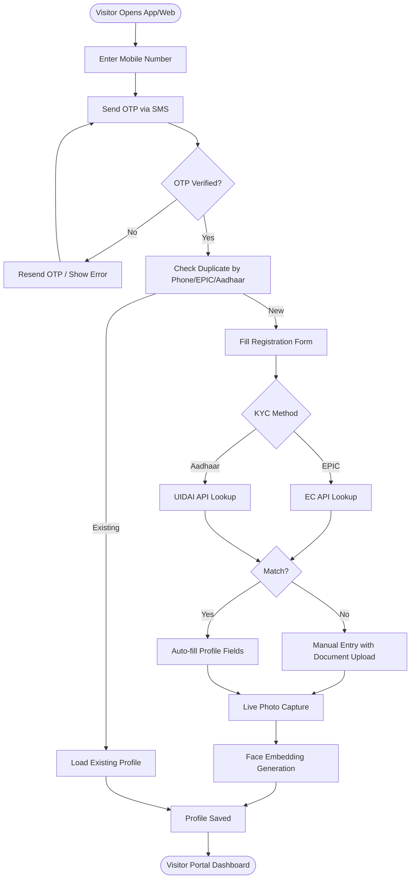

### 16.2 Appointment Submission Flow

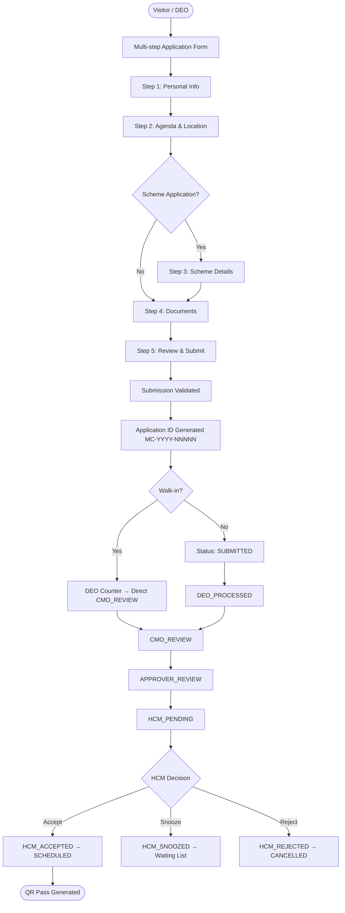

### 16.3 Scheme Application Workflow

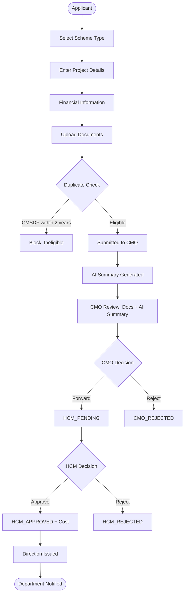

### 16.4 Approval Hierarchy Flow

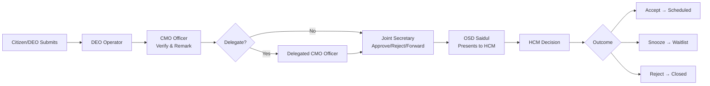

### 16.5 Scheduling Engine Flow

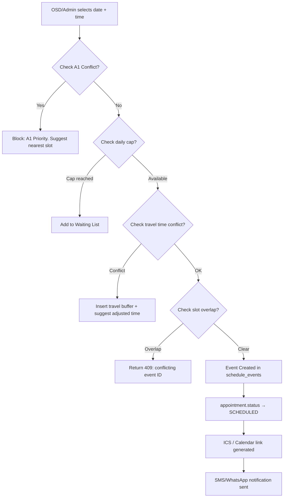

### 16.6 Direction Color-Coding Flow

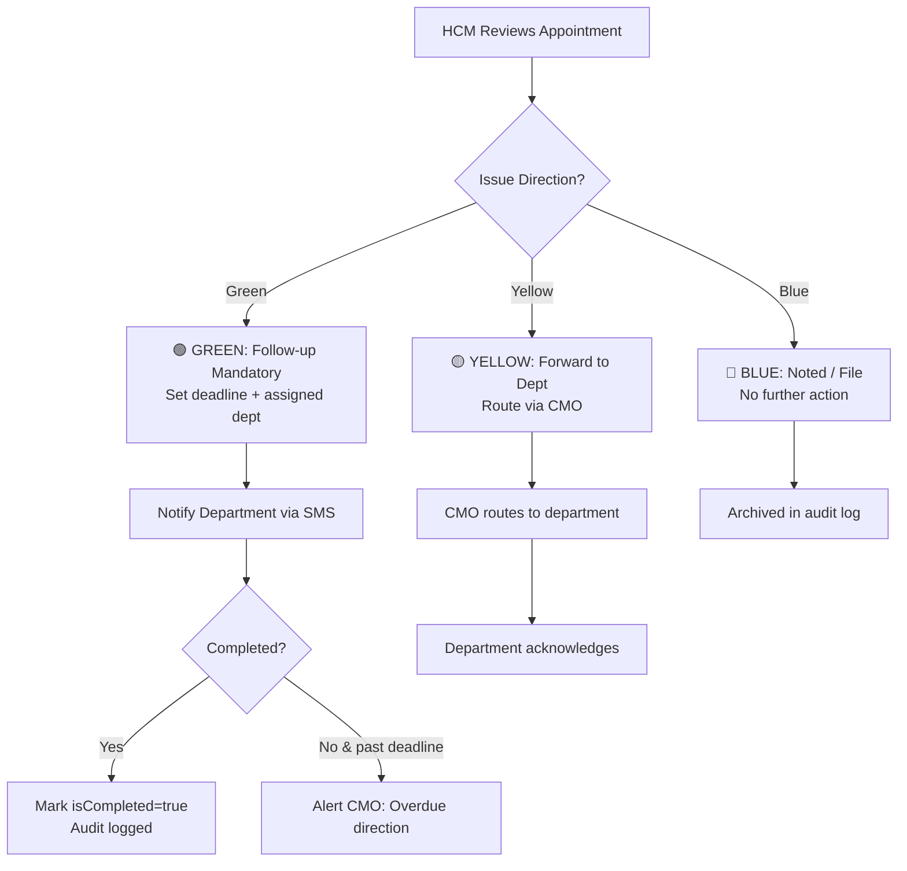

### 16.7 QR Pass + Face Verification Flow

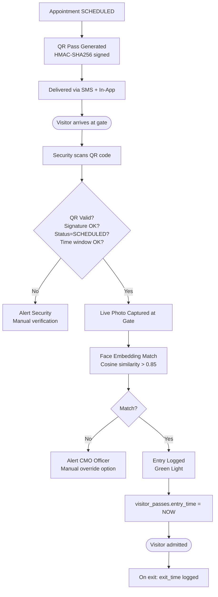

### 16.8 Grievance Management Flow

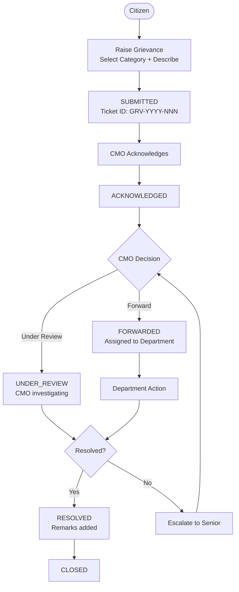

### 16.9 Heatmap Analytics Flow

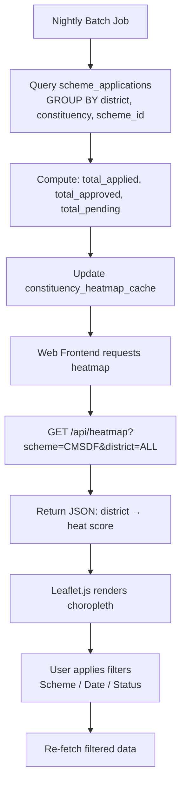

### 16.10 Audit Trail Flow

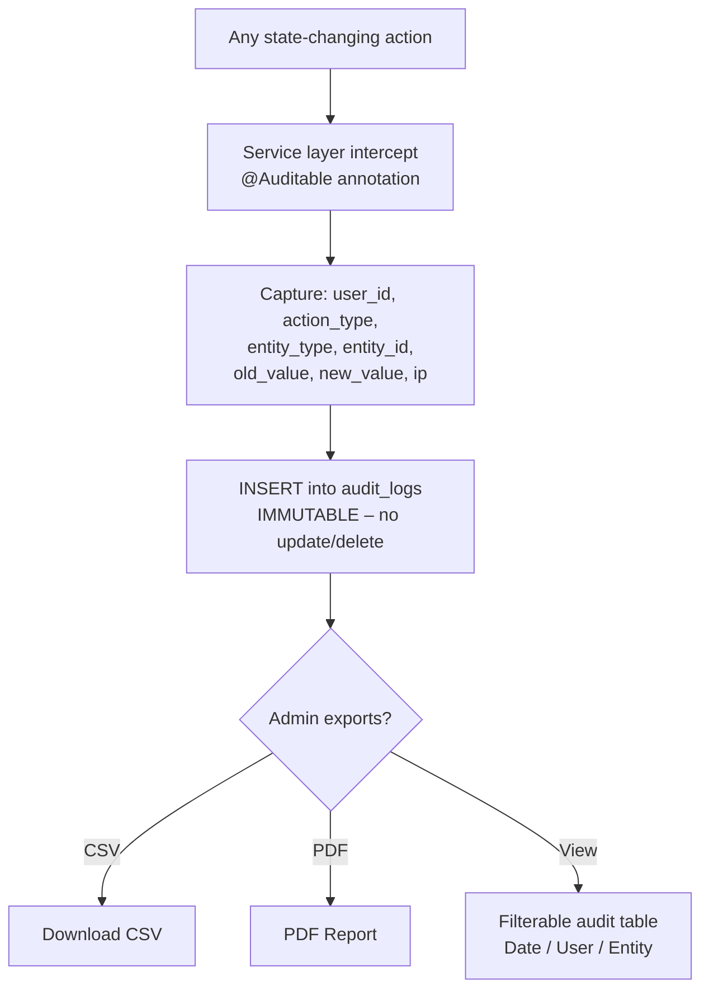

---

## 17. ER Diagram

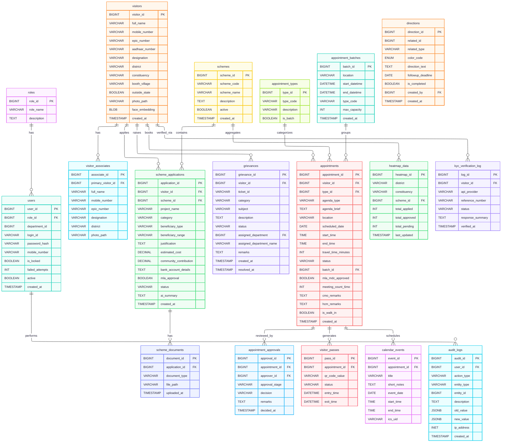

---

## 18. System Architecture Diagram

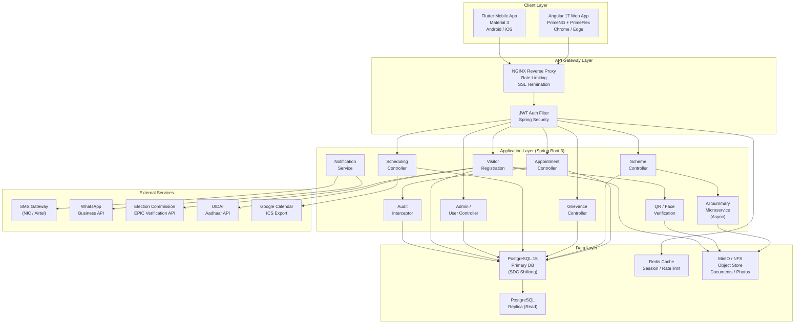

### 18.1 Component Responsibilities

| Component | Responsibility |
|---|---|
| Angular Web | Staff-facing SPA; full CMO dashboard; scheduling calendar |
| Flutter Mobile | HCM + DEO mobile app; offline mode; face capture |
| NGINX | Reverse proxy; SSL (HTTPS 443); rate limiting (100 req/min) |
| Spring Boot API | REST endpoints; business logic; JWT validation |
| PostgreSQL | Primary RDBMS; all transactional data |
| Redis | JWT token blacklist; session cache; API rate-limit counter |
| MinIO / NFS | Document / photo file storage (not BLOBs in DB) |
| AI Microservice | Async OCR + LLM summarisation; independent scaling |
| Notification Service | SMS/WhatsApp/Push delivery; retry queue |

---

## 19. Deployment Architecture

### 19.1 Infrastructure Overview

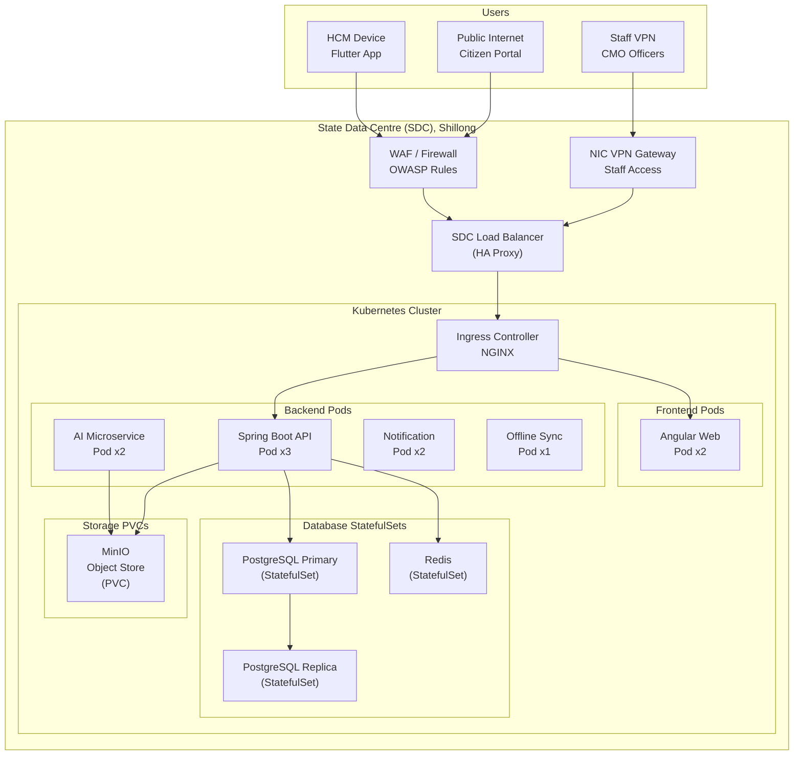

### 19.2 Environment Tiers

| Environment | Purpose | URL |
|---|---|---|
| **DEV** | Development & unit testing | `dev.meghaconnect.internal` |
| **SIT** | System Integration Testing | `sit.meghaconnect.internal` |
| **UAT** | User Acceptance Testing | `uat.meghaconnect.meg.gov.in` |
| **PROD** | Production | `meghaconnect.meg.gov.in` |

### 19.3 Docker Compose (DEV)

```yaml
version: '3.9'
services:
  frontend:
    build: ./frontend
    ports: ["4200:80"]
  backend:
    build: ./backend
    ports: ["8080:8080"]
    depends_on: [postgres, redis]
    environment:
      SPRING_DATASOURCE_URL: jdbc:postgresql://postgres:5432/meghaconnect
      JWT_SECRET: ${JWT_SECRET}
  postgres:
    image: postgres:15
    volumes: ["pg_data:/var/lib/postgresql/data"]
    environment:
      POSTGRES_DB: meghaconnect
      POSTGRES_USER: megha_user
      POSTGRES_PASSWORD: ${DB_PASSWORD}
  redis:
    image: redis:7-alpine
    ports: ["6379:6379"]
  minio:
    image: minio/minio
    command: server /data --console-address ":9001"
    volumes: ["minio_data:/data"]
volumes:
  pg_data:
  minio_data:
```

### 19.4 Security Requirements

| Area | Requirement |
|---|---|
| Transport | TLS 1.3 minimum; HSTS enabled |
| Authentication | JWT (15-min access token; 7-day refresh token) |
| Authorisation | RBAC enforced at API level; field-level masking for Aadhaar |
| Data at Rest | AES-256 encryption for PII fields (Aadhaar, face embeddings) |
| File Store | Signed URLs with 30-minute expiry for document access |
| Audit | All actions logged; audit logs immutable |
| Network | WAF (OWASP CRS); DDoS protection; IP allowlist for admin APIs |
| Mobile | Device keystore for offline data encryption |
| Backups | Daily automated backups; 30-day retention; off-site copy |

### 19.5 High Availability

| Component | Strategy |
|---|---|
| Backend API | 3 pods; rolling deployment; readiness probe on `/actuator/health` |
| PostgreSQL | Primary-replica streaming replication; failover via Patroni |
| Redis | Sentinel mode (3 nodes) |
| MinIO | Distributed mode (4 nodes, erasure coding) |
| Frontend | 2 pods; CDN-backed static assets |

### 19.6 Disaster Recovery

| RTO | RPO | Strategy |
|---|---|---|
| 4 hours | 1 hour | PostgreSQL PITR (Point-In-Time Recovery) from WAL archive |

---

*End of SRS Document*

---

**Document Control**

| Version | Date | Author | Changes |
|---|---|---|---|
| 0.1 | Feb 2026 | CMO Tech Team | Initial draft |
| 1.0 | Mar 2026 | CMO Tech Team | Full specification with Mermaid diagrams |
| 1.1 | Mar 2026 | Agent Narsingh | Added automated task-assignment workflow; all future tasks auto-routed to #agent-Narsingh and SRS auto-updated on each change |

> **Workflow Note:** From version 1.1 onwards, all development tasks are automatically assigned to `#agent-Narsingh` (see `.github/copilot-instructions.md` and `docs/task-assignment-prompt.md`). The agent updates this SRS document after every task.

**Approval**

| Role | Name | Signature | Date |
|---|---|---|---|
| Principal Secretary (IT) | | | |
| CMO (Systems) | | | |
| NIC Meghalaya | | | |
