# MeghaConnect — Government Entry-Exit Management System
## Enterprise System Documentation

**Document Version:** 1.0  
**Prepared By:** Principal Solution Architect  
**Classification:** RESTRICTED — Government of Meghalaya  
**Last Updated:** 2026-03-03  

---

## Table of Contents

1. [Project Overview](#1-project-overview)
2. [Functional Requirements](#2-functional-requirements)
3. [Non-Functional Requirements](#3-non-functional-requirements)
4. [High-Level System Architecture](#4-high-level-system-architecture)
5. [Microservices Architecture](#5-microservices-architecture)
6. [Module-wise Design](#6-module-wise-design)
7. [Screen-wise User Flow](#7-screen-wise-user-flow)
8. [Flowcharts](#8-flowcharts)
9. [Sequence Diagrams](#9-sequence-diagrams)
10. [Database Schema (ER Diagrams)](#10-database-schema-er-diagrams)
11. [API Contracts](#11-api-contracts)
12. [Security Architecture](#12-security-architecture)
13. [Audit & Logging Design](#13-audit--logging-design)
14. [Deployment Architecture](#14-deployment-architecture)
15. [Folder Structure](#15-folder-structure)

---

## 1. Project Overview

### 1.1 Background

The **MeghaConnect Entry-Exit Management System** is a digital governance initiative by the **Government of Meghalaya** to modernise visitor management at sensitive government premises (Secretariat, Chief Minister's Office, District Headquarters, Checkpoints). The system replaces manual visitor registers with a secure, auditable, real-time digital workflow that spans pre-registration, document verification, biometric/QR-based access, and post-visit reporting.

### 1.2 Objectives

| # | Objective |
|---|-----------|
| 1 | Provide a secure, self-service visitor pre-registration portal |
| 2 | Enable online document upload and OTP-verified identity proofing |
| 3 | Streamline admin approval / rejection of visitor requests |
| 4 | Automate gate-level entry and exit via QR code scanning |
| 5 | Detect and alert on overstay automatically |
| 6 | Generate real-time dashboards and district-wise analytics |
| 7 | Maintain a tamper-proof audit trail for compliance and forensics |

### 1.3 Scope

| In Scope | Out of Scope |
|----------|-------------|
| Visitor pre-registration (web + mobile) | Physical biometric hardware integration (Phase 2) |
| Document upload and KYC verification | Payment gateway |
| Admin approval workflow | Aadhaar e-KYC real-time API (plug-and-play ready) |
| QR-code based entry and exit | Face recognition at gate (Phase 2) |
| Overstay detection and alerting | Video surveillance integration |
| Reporting and heatmap dashboard | |
| Role-based admin management | |

### 1.4 Stakeholders

| Role | Responsibility |
|------|---------------|
| Visitor / Citizen | Self-registers, uploads documents, presents QR at gate |
| Gate Officer | Scans QR, records entry/exit, handles exceptions |
| District Admin | Approves/rejects visitor requests for their district |
| Super Admin | Manages roles, users, districts, checkpoints |
| Reporting Officer | Views dashboards, generates reports |

### 1.5 Technology Stack

| Layer | Technology |
|-------|-----------|
| Frontend | Angular 17+ (Standalone Components, Signals) |
| Backend | Spring Boot 3.x Microservices (Java 21) |
| Database | PostgreSQL 15+ |
| Authentication | JWT + Role-Based Access Control (RBAC) |
| File Storage | MinIO / NFS (object-store abstraction) |
| Containerisation | Docker + Docker Compose |
| Reverse Proxy | Nginx |
| OS | Linux (Ubuntu 22.04 LTS) |
| Mobile | Flutter (Android + iOS) |
| Migrations | Flyway |

---

## 2. Functional Requirements

### 2.1 Visitor Registration Module

| Req ID | Requirement |
|--------|------------|
| VR-01 | The system shall allow visitors to pre-register online using full name, phone number, purpose of visit, and target district/checkpoint |
| VR-02 | The system shall send an OTP to the visitor's registered mobile number for phone verification |
| VR-03 | The system shall allow upload of identity documents: EPIC (Voter ID), Aadhaar, or Passport |
| VR-04 | The system shall generate a unique `VISIT-YYYY-XXXXXXXX` registration reference number upon successful pre-registration |
| VR-05 | The system shall support re-submission after admin rejection with updated documents |
| VR-06 | The system shall notify the visitor via SMS/push upon approval or rejection |
| VR-07 | The system shall allow visitors to view their current application status online |

### 2.2 Entry Approval Module

| Req ID | Requirement |
|--------|------------|
| EA-01 | District admin shall be able to view a paginated queue of pending visitor applications |
| EA-02 | Admin shall be able to open an application and view uploaded documents inline |
| EA-03 | Admin shall be able to validate or flag each document individually |
| EA-04 | Admin shall be able to approve a visit request, specifying valid entry window (date, time) |
| EA-05 | Admin shall be able to reject a visit request with a mandatory rejection reason |
| EA-06 | On approval, the system shall generate and issue a QR code (JWT-signed payload) to the visitor |
| EA-07 | The system shall escalate pending requests older than a configurable SLA hours to a supervisor |

### 2.3 Entry Checkpoint Module

| Req ID | Requirement |
|--------|------------|
| EC-01 | Gate officer shall be able to scan a visitor's QR code using a web or mobile scanner |
| EC-02 | The system shall validate the QR code's signature, expiry, and entry window |
| EC-03 | The system shall display visitor details and photo for visual confirmation |
| EC-04 | On successful scan, the system shall record entry timestamp, gate officer ID, and checkpoint ID |
| EC-05 | The system shall reject expired or tampered QR codes and log the attempt |
| EC-06 | Gate officer shall be able to override and manually record entry with supervisor authorisation |

### 2.4 Exit Checkpoint Module

| Req ID | Requirement |
|--------|------------|
| EX-01 | Gate officer shall scan the visitor's QR at exit to record exit timestamp |
| EX-02 | The system shall calculate visit duration (exit - entry) |
| EX-03 | The system shall compare duration against approved visit window and raise an overstay alert if exceeded |
| EX-04 | The system shall automatically escalate unresolved overstay alerts after a configurable threshold |
| EX-05 | Exit records shall be linked to the original entry record |

### 2.5 Reporting & Dashboard Module

| Req ID | Requirement |
|--------|------------|
| RP-01 | Dashboard shall display today's total entries, total exits, active visitors, and pending approvals in real-time |
| RP-02 | The system shall provide district-wise visitor count aggregated by date range |
| RP-03 | The system shall provide a heatmap visualisation of visitor density by district/constituency |
| RP-04 | Reporting officer shall be able to export reports in CSV and PDF format |
| RP-05 | The system shall support date-range, district, and checkpoint filters on all reports |

### 2.6 Admin Management Module

| Req ID | Requirement |
|--------|------------|
| AM-01 | Super admin shall be able to create, update, deactivate, and delete system users |
| AM-02 | Super admin shall be able to assign roles (VISITOR, GATE_OFFICER, DISTRICT_ADMIN, REPORTING_OFFICER, SUPER_ADMIN) |
| AM-03 | Super admin shall be able to configure districts and their associated checkpoints |
| AM-04 | Super admin shall be able to set approval SLA thresholds per district |
| AM-05 | Super admin shall be able to view and export the system audit trail |

---

## 3. Non-Functional Requirements

### 3.1 Performance

| NFR ID | Requirement |
|--------|------------|
| PF-01 | API response time shall be ≤ 500 ms at P95 under 200 concurrent users |
| PF-02 | QR code scan and verification shall complete within 2 seconds end-to-end |
| PF-03 | Dashboard data refresh shall occur every 60 seconds or on-demand |
| PF-04 | Report generation for a 30-day range shall complete within 10 seconds |

### 3.2 Availability & Reliability

| NFR ID | Requirement |
|--------|------------|
| AV-01 | System availability shall be ≥ 99.5% during government working hours (08:00–20:00 IST) |
| AV-02 | Planned maintenance windows shall be restricted to 22:00–04:00 IST |
| AV-03 | Database shall be replicated (primary–replica) with automated failover |

### 3.3 Security

| NFR ID | Requirement |
|--------|------------|
| SC-01 | All communication shall be encrypted via TLS 1.2 or higher |
| SC-02 | JWT tokens shall expire within 24 hours and must be refreshed |
| SC-03 | Passwords shall be stored as BCrypt hashes (cost factor ≥ 12) |
| SC-04 | Document uploads shall be stored outside the web root with access-controlled URLs |
| SC-05 | All admin actions shall generate an immutable audit log entry |
| SC-06 | Rate limiting shall be applied to OTP endpoints (max 5 requests per 10 minutes per phone) |

### 3.4 Scalability

| NFR ID | Requirement |
|--------|------------|
| SL-01 | The system shall support horizontal scaling of stateless microservices |
| SL-02 | Database read replicas shall be used for reporting queries |
| SL-03 | File storage shall support min 1 TB with expandable NFS/object store |

### 3.5 Compliance

| NFR ID | Requirement |
|--------|------------|
| CP-01 | Audit logs shall be retained for a minimum of 5 years |
| CP-02 | Personal data shall be handled per the Digital Personal Data Protection Act 2023 (India) |
| CP-03 | System shall support data export and deletion requests for individuals |

---

## 4. High-Level System Architecture

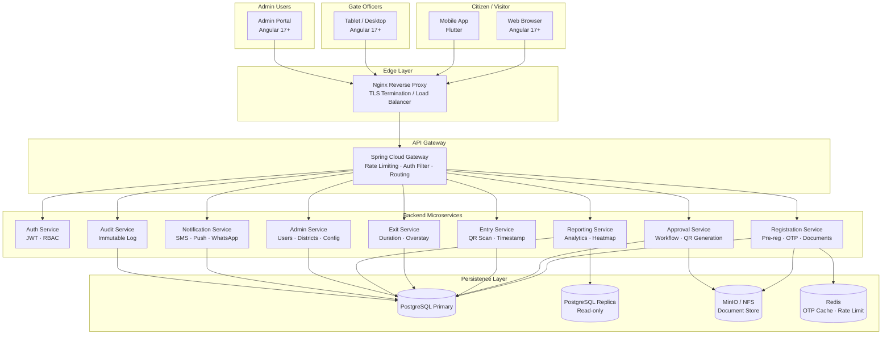

---

## 5. Microservices Architecture

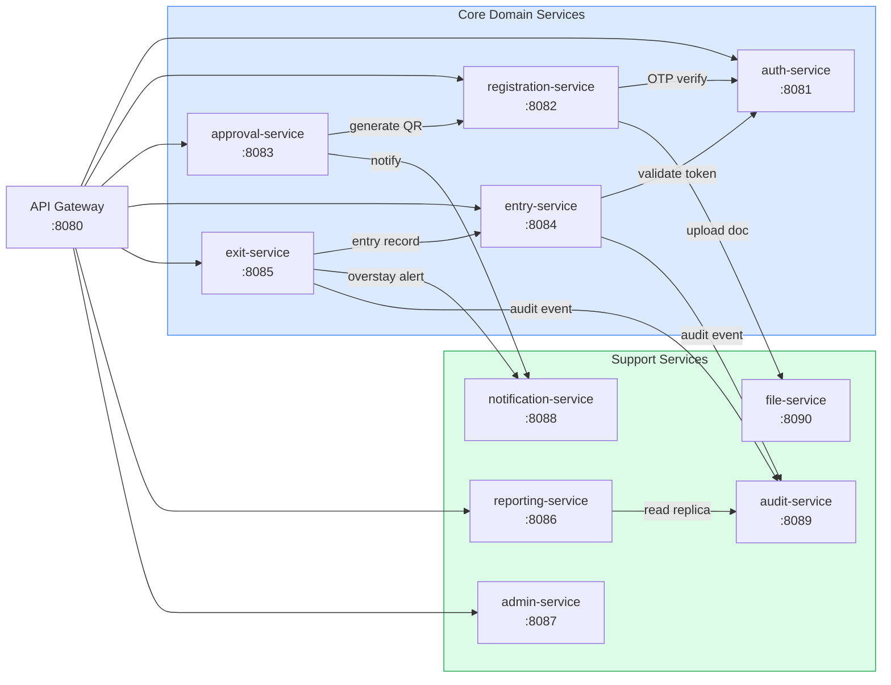

### 5.1 Service Responsibilities

| Service | Port | Responsibilities |
|---------|------|-----------------|
| `auth-service` | 8081 | Login, JWT issuance, token refresh, OTP generation/validation, RBAC |
| `registration-service` | 8082 | Visitor pre-registration, document upload, status tracking |
| `approval-service` | 8083 | Application queue, document review, approve/reject, QR issuance |
| `entry-service` | 8084 | QR scan validation, entry recording, gate officer interface |
| `exit-service` | 8085 | Exit recording, duration calculation, overstay detection |
| `reporting-service` | 8086 | Dashboard aggregation, district analytics, heatmap, CSV/PDF export |
| `admin-service` | 8087 | User management, role config, district/checkpoint config, SLA config |
| `notification-service` | 8088 | SMS, push notifications, WhatsApp messages |
| `audit-service` | 8089 | Immutable audit log writes and queries |
| `file-service` | 8090 | Document upload/download proxy to MinIO/NFS |

---

## 6. Module-wise Design

### 6.1 Visitor Registration Module

**Actors:** Visitor/Citizen  
**Entry Point:** Public portal (no authentication required for initial pre-registration)

| Component | Description |
|-----------|-------------|
| `VisitorRegistrationFormComponent` | Multi-step Angular form (personal info → document upload → OTP → review) |
| `RegistrationService` | Angular service handling API calls to `registration-service` |
| `RegistrationController` (Spring) | REST endpoints for registration CRUD |
| `PublicRegistration` (JPA Entity) | Core registration record |
| `KycVerificationLog` (JPA Entity) | Audit of each EPIC/Aadhaar API call |

**Registration States:**  
`DRAFT` → `OTP_PENDING` → `SUBMITTED` → `UNDER_REVIEW` → `APPROVED` / `REJECTED` → `EXPIRED`

---

### 6.2 Entry Approval Module

**Actors:** District Admin, Approver  
**Entry Point:** Admin portal (role: DISTRICT_ADMIN or APPROVER)

| Component | Description |
|-----------|-------------|
| `ApprovalQueueComponent` | Paginated table of pending registrations filtered by district |
| `ApplicationDetailComponent` | Document viewer, KYC status, approve/reject form |
| `ApprovalService` | Angular service for approval API calls |
| `ApprovalController` (Spring) | REST endpoints for approval workflow |
| `VisitApproval` (JPA Entity) | Approval record with approved window and QR reference |

**Approval States:**  
`PENDING` → `IN_REVIEW` → `APPROVED` / `REJECTED` / `ESCALATED`

---

### 6.3 Entry Checkpoint Module

**Actors:** Gate Officer  
**Entry Point:** Gate officer terminal (role: GATE_OFFICER)

| Component | Description |
|-----------|-------------|
| `QrScannerComponent` | Web-based QR scanner using device camera |
| `EntryConfirmComponent` | Displays visitor details post-scan for officer confirmation |
| `EntryService` (Angular) | API calls to `entry-service` |
| `EntryController` (Spring) | QR validation and entry record creation |
| `VisitEntry` (JPA Entity) | Entry record (visitor, checkpoint, gate officer, timestamp) |

---

### 6.4 Exit Checkpoint Module

**Actors:** Gate Officer  
**Entry Point:** Gate officer terminal (role: GATE_OFFICER)

| Component | Description |
|-----------|-------------|
| `ExitScannerComponent` | QR scan at exit gate |
| `ExitConfirmComponent` | Shows duration and flags overstay |
| `ExitService` (Angular) | API calls to `exit-service` |
| `ExitController` (Spring) | Duration calc, overstay check, exit record creation |
| `VisitExit` (JPA Entity) | Exit record linked to entry record |

---

### 6.5 Reporting & Dashboard Module

**Actors:** Reporting Officer, Admin  
**Entry Point:** Dashboard (role: REPORTING_OFFICER or DISTRICT_ADMIN or SUPER_ADMIN)

| Component | Description |
|-----------|-------------|
| `DashboardComponent` | KPI tiles (entries, exits, active, pending) with 60 s auto-refresh |
| `HeatmapComponent` | District-level SVG/Leaflet heatmap |
| `AnalyticsTableComponent` | Filterable data grid with export |
| `ReportingService` (Angular) | API calls to `reporting-service` |
| `ReportingController` (Spring) | Aggregation queries against read replica |

---

### 6.6 Admin Management Module

**Actors:** Super Admin  
**Entry Point:** Admin console (role: SUPER_ADMIN)

| Component | Description |
|-----------|-------------|
| `UserManagementComponent` | CRUD users, assign roles, deactivate |
| `RoleConfigComponent` | Define permissions per role |
| `DistrictConfigComponent` | Add/edit districts, map to checkpoints |
| `CheckpointConfigComponent` | Add/edit checkpoints, assign gate officers |
| `AdminController` (Spring) | REST endpoints for all admin configuration |

---

## 7. Screen-wise User Flow

### 7.1 Visitor Pre-Registration Flow

```
[Landing Page]
      │
      ▼
[Step 1 – Personal Info]
  • Full Name, Phone, Purpose, Target District/Checkpoint
      │
      ▼
[Step 2 – Document Upload]
  • Choose doc type: EPIC / Aadhaar / Passport
  • Upload front & back images (max 2 MB each)
      │
      ▼
[Step 3 – OTP Verification]
  • Enter 6-digit OTP sent to phone
  • Resend option after 60 s
      │
      ▼
[Step 4 – Review & Submit]
  • Summary of all entered data
  • Confirm submission
      │
      ▼
[Confirmation Page]
  • Display VISIT-YYYY-XXXXXXXX reference
  • SMS/email sent with status tracking link
      │
      ▼
[Status Tracking Page]
  • Visitor enters reference number + phone OTP
  • View current status and admin remarks
```

---

### 7.2 Admin Approval Flow

```
[Login → Admin Portal]
      │
      ▼
[Approval Queue]
  • Pending | Under Review | All
  • Filter by district, date, urgency
      │
      ▼
[Application Detail]
  • Visitor info, purpose, documents
  • KYC verification status (EPIC/Aadhaar API result)
      │
      ├──[APPROVE]──►[Set Entry Window]──►[Confirm]──►[QR Issued to Visitor]
      │
      └──[REJECT]───►[Enter Reason]────►[Confirm]──►[Rejection SMS to Visitor]
```

---

### 7.3 Gate Entry Flow

```
[Gate Officer Login]
      │
      ▼
[Entry Scanner Screen]
  • Activate camera / scan wand
  • Scan visitor's QR code
      │
      ▼
[Validation Result]
  ├─[VALID]──►[Show visitor photo + details]
  │             │
  │             ▼
  │           [Confirm Entry]──►[Entry recorded + timestamp]
  │
  └─[INVALID/EXPIRED]──►[Error message + alert logged]
                           │
                           ▼
                         [Manual Override (supervisor auth)]
```

---

### 7.4 Gate Exit Flow

```
[Exit Scanner Screen]
  • Scan visitor's QR code
      │
      ▼
[Exit Validation]
  ├─[VALID]──►[Show entry record + duration]
  │             ├─[Within allowed window]──►[Confirm Exit]──►[Record exit]
  │             └─[Overstay detected]──────►[Confirm Exit + Flag alert]
  │
  └─[INVALID]──►[Error message]
```

---

## 8. Flowcharts

### 8.1 OTP Verification Flowchart

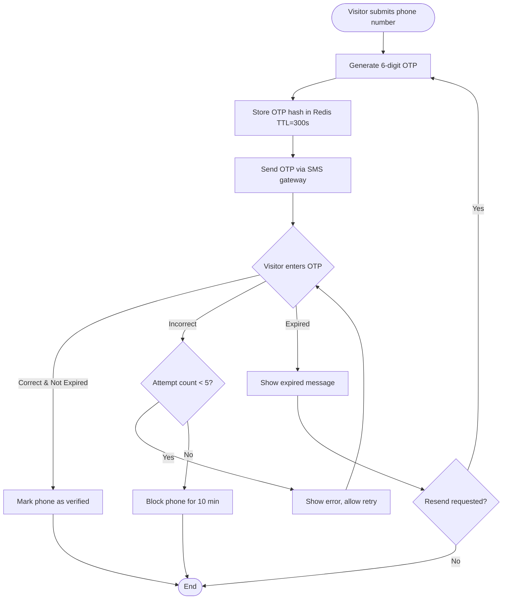

---

### 8.2 Entry Approval Flowchart

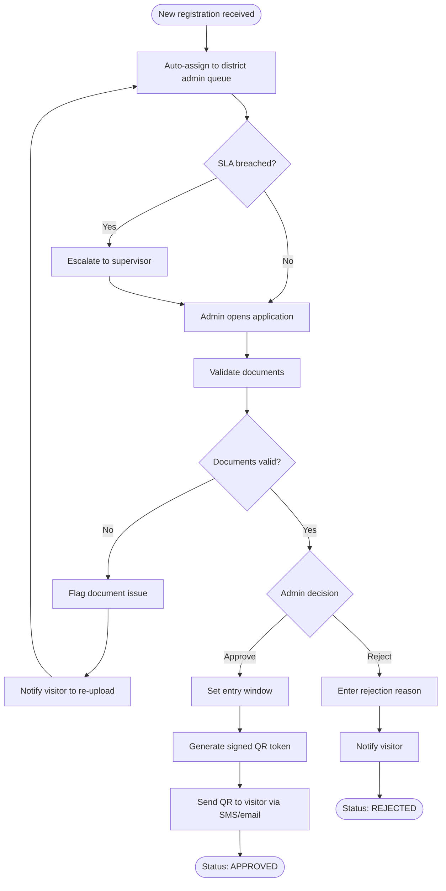

---

### 8.3 Entry-Exit Lifecycle Flowchart

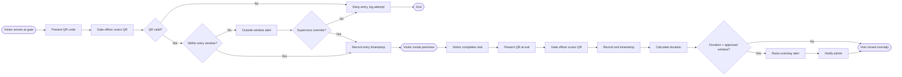

---

### 8.4 Overstay Detection Flowchart

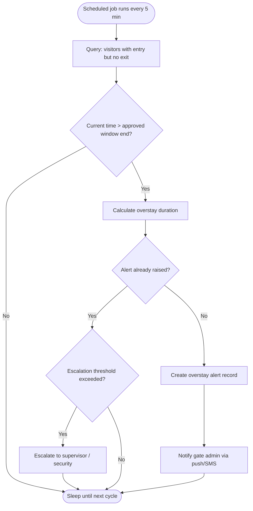

---

## 9. Sequence Diagrams

### 9.1 Visitor Pre-Registration Sequence

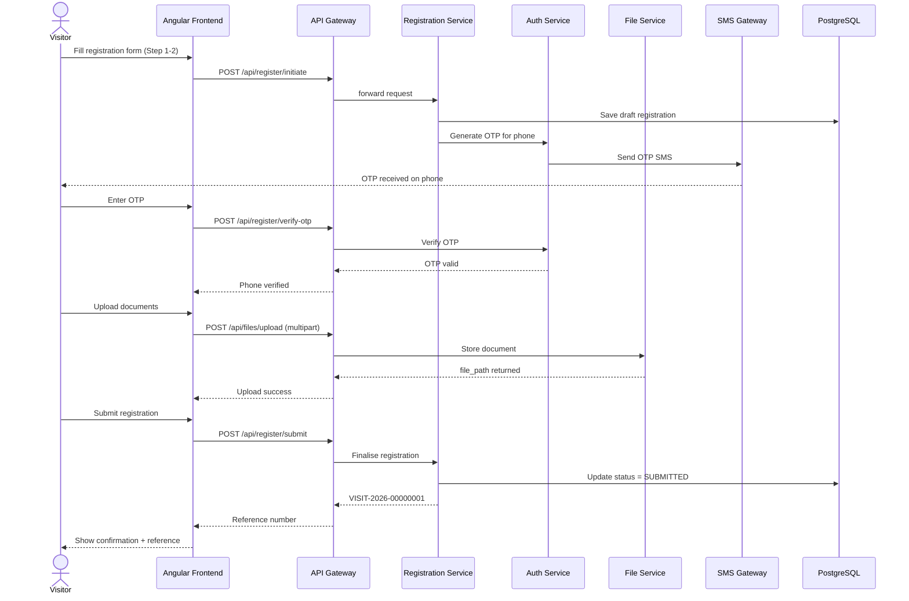

---

### 9.2 Entry Approval Sequence

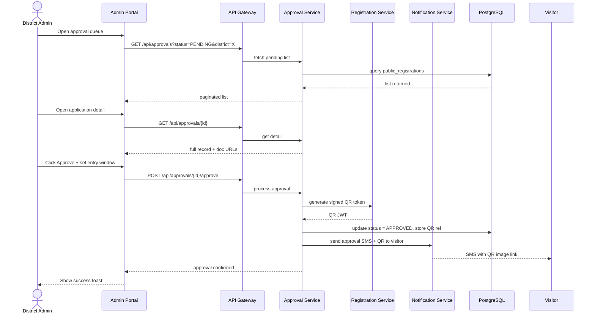

---

### 9.3 QR Entry Verification Sequence

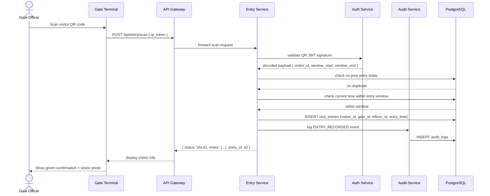

---

### 9.4 Exit & Overstay Sequence

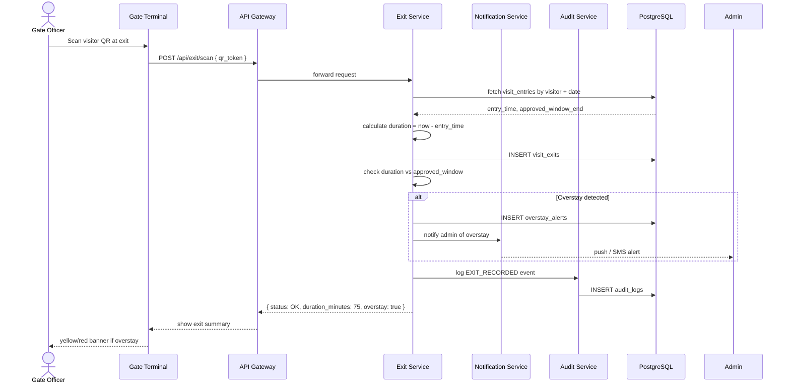

---

## 10. Database Schema (ER Diagrams)

### 10.1 Core Authentication & Users Schema

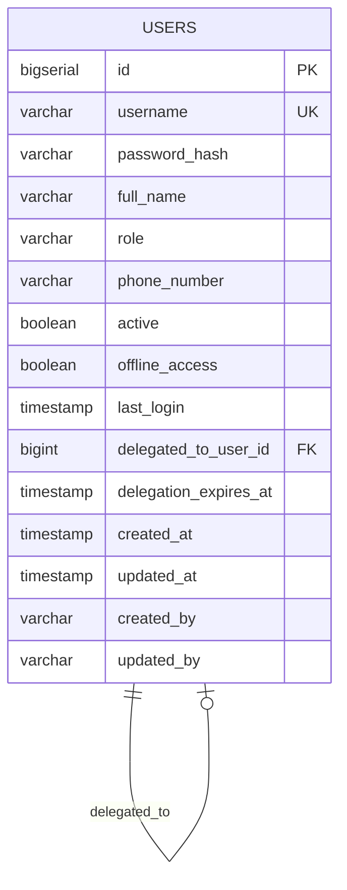

**Indexes:** `idx_users_username (username)`, `idx_users_role (role)`, `idx_users_active (active)`

---

### 10.2 Visitor Registration Schema

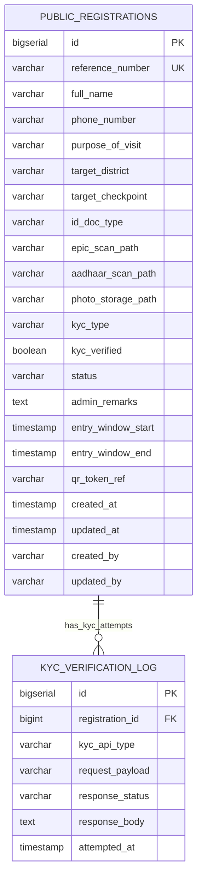

**Indexes:** `idx_reg_phone (phone_number)`, `idx_reg_status (status)`, `idx_reg_district (target_district)`, `idx_reg_reference (reference_number)`

---

### 10.3 Entry & Exit Schema

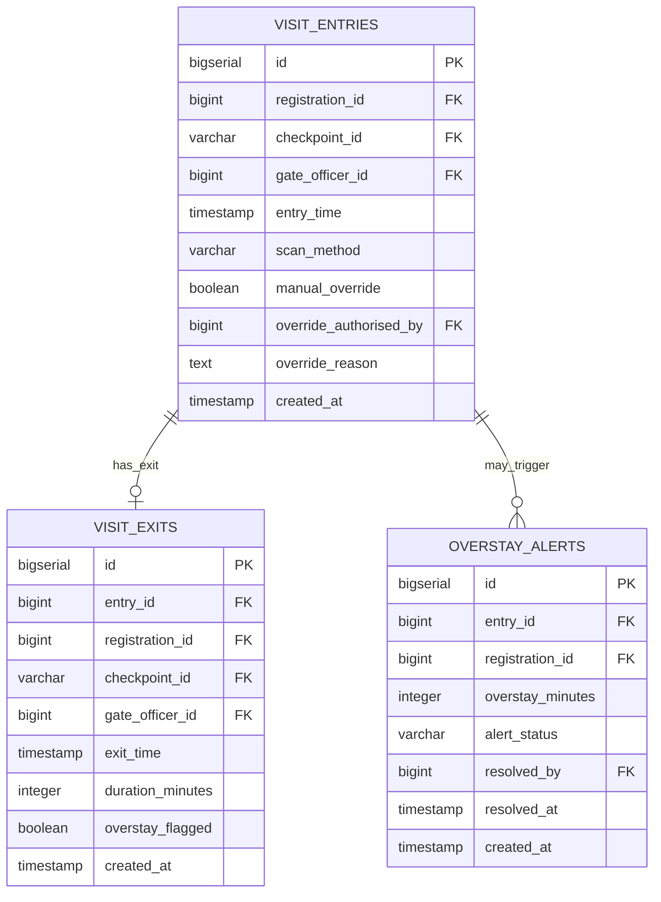

**Indexes:** `idx_entry_registration (registration_id)`, `idx_entry_time (entry_time)`, `idx_entry_checkpoint (checkpoint_id)`, `idx_exit_entry (entry_id)`, `idx_overstay_status (alert_status)`

---

### 10.4 Admin Configuration Schema

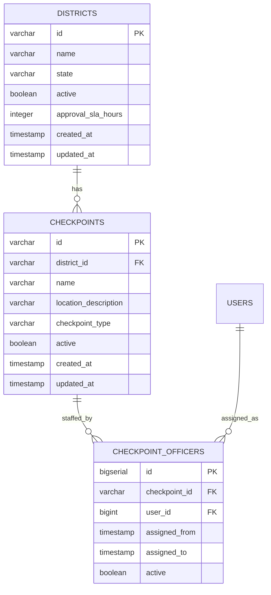

---

### 10.5 Reporting & Audit Schema

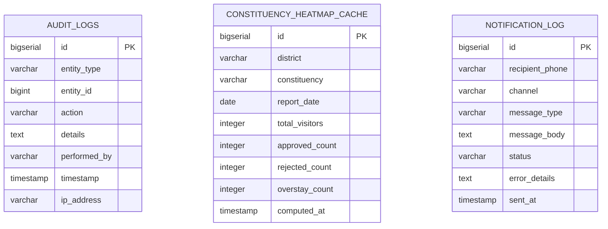

**Indexes:** `idx_audit_entity (entity_type, entity_id)`, `idx_audit_user (performed_by)`, `idx_audit_time (timestamp)`, `idx_heatmap_district_date (district, report_date)`

---

## 11. API Contracts

### 11.1 Authentication APIs

#### POST `/api/auth/login`

**Request:**
```json
{
  "username": "gate_officer_1",
  "password": "P@ssw0rd!"
}
```

**Response 200:**
```json
{
  "accessToken": "eyJhbGci...",
  "tokenType": "Bearer",
  "expiresIn": 86400,
  "user": {
    "id": 12,
    "username": "gate_officer_1",
    "fullName": "Ramesh Kumar",
    "role": "GATE_OFFICER"
  }
}
```

**Response 401:**
```json
{ "error": "INVALID_CREDENTIALS", "message": "Username or password is incorrect" }
```

---

#### POST `/api/auth/otp/send`

**Request:**
```json
{ "phoneNumber": "+917005012345" }
```

**Response 200:**
```json
{ "message": "OTP sent", "expiresIn": 300 }
```

---

#### POST `/api/auth/otp/verify`

**Request:**
```json
{ "phoneNumber": "+917005012345", "otp": "482910" }
```

**Response 200:**
```json
{ "verified": true, "sessionToken": "eyJhbGci..." }
```

---

### 11.2 Visitor Registration APIs

#### POST `/api/register/initiate`

**Request:**
```json
{
  "fullName": "John Doe",
  "phoneNumber": "+917005012345",
  "purposeOfVisit": "OFFICIAL_MEETING",
  "targetDistrict": "EAST_KHASI_HILLS",
  "targetCheckpoint": "SECRETARIAT_MAIN"
}
```

**Response 201:**
```json
{
  "referenceNumber": "VISIT-2026-00000042",
  "status": "OTP_PENDING",
  "message": "OTP sent to registered phone"
}
```

---

#### POST `/api/register/submit`

**Headers:** `Authorization: Bearer <session_token>`

**Request:**
```json
{
  "referenceNumber": "VISIT-2026-00000042",
  "idDocType": "EPIC",
  "epicScanPath": "documents/epic/uuid-1.pdf",
  "photoStoragePath": "photos/visitors/uuid-1.jpg"
}
```

**Response 200:**
```json
{
  "referenceNumber": "VISIT-2026-00000042",
  "status": "SUBMITTED",
  "submittedAt": "2026-03-03T08:30:00Z"
}
```

---

#### GET `/api/register/status/{referenceNumber}`

**Response 200:**
```json
{
  "referenceNumber": "VISIT-2026-00000042",
  "status": "APPROVED",
  "adminRemarks": null,
  "entryWindowStart": "2026-03-05T09:00:00Z",
  "entryWindowEnd": "2026-03-05T17:00:00Z",
  "qrAvailable": true
}
```

---

### 11.3 Approval APIs

#### GET `/api/approvals?status=PENDING&district=EAST_KHASI_HILLS&page=0&size=20`

**Headers:** `Authorization: Bearer <admin_token>`

**Response 200:**
```json
{
  "content": [
    {
      "id": 101,
      "referenceNumber": "VISIT-2026-00000042",
      "fullName": "John Doe",
      "purpose": "OFFICIAL_MEETING",
      "district": "EAST_KHASI_HILLS",
      "submittedAt": "2026-03-03T08:30:00Z",
      "kycStatus": "VERIFIED"
    }
  ],
  "totalElements": 35,
  "totalPages": 2
}
```

---

#### POST `/api/approvals/{id}/approve`

**Headers:** `Authorization: Bearer <admin_token>`

**Request:**
```json
{
  "entryWindowStart": "2026-03-05T09:00:00Z",
  "entryWindowEnd": "2026-03-05T17:00:00Z",
  "remarks": "Approved for official meeting at Secretariat"
}
```

**Response 200:**
```json
{
  "referenceNumber": "VISIT-2026-00000042",
  "status": "APPROVED",
  "qrTokenRef": "QR-2026-A0042",
  "message": "Visitor notified via SMS"
}
```

---

#### POST `/api/approvals/{id}/reject`

**Request:**
```json
{
  "reason": "Incomplete document — EPIC scan illegible. Please re-upload."
}
```

**Response 200:**
```json
{
  "referenceNumber": "VISIT-2026-00000042",
  "status": "REJECTED",
  "message": "Visitor notified via SMS"
}
```

---

### 11.4 Entry / Exit APIs

#### POST `/api/entry/scan`

**Headers:** `Authorization: Bearer <gate_officer_token>`

**Request:**
```json
{
  "qrToken": "eyJhbGci...",
  "checkpointId": "SECRETARIAT_MAIN",
  "scanMethod": "QR_CAMERA"
}
```

**Response 200:**
```json
{
  "entryId": 9001,
  "status": "VALID",
  "visitor": {
    "fullName": "John Doe",
    "photoUrl": "/api/files/photos/uuid-1.jpg",
    "purpose": "OFFICIAL_MEETING",
    "approvedWindowEnd": "2026-03-05T17:00:00Z"
  },
  "entryTime": "2026-03-05T10:15:00Z"
}
```

**Response 400 (invalid QR):**
```json
{
  "status": "INVALID",
  "reason": "QR_EXPIRED",
  "message": "Visitor QR token has expired"
}
```

---

#### POST `/api/exit/scan`

**Headers:** `Authorization: Bearer <gate_officer_token>`

**Request:**
```json
{
  "qrToken": "eyJhbGci...",
  "checkpointId": "SECRETARIAT_MAIN"
}
```

**Response 200:**
```json
{
  "exitId": 8001,
  "entryId": 9001,
  "exitTime": "2026-03-05T12:45:00Z",
  "durationMinutes": 150,
  "overstayFlagged": false
}
```

---

### 11.5 Reporting APIs

#### GET `/api/reports/dashboard`

**Response 200:**
```json
{
  "totalEntriesToday": 142,
  "totalExitsToday": 118,
  "activeVisitors": 24,
  "pendingApprovals": 7,
  "overstayAlerts": 2,
  "generatedAt": "2026-03-05T13:00:00Z"
}
```

---

#### GET `/api/reports/district-summary?from=2026-03-01&to=2026-03-05`

**Response 200:**
```json
{
  "districts": [
    { "district": "EAST_KHASI_HILLS", "totalVisitors": 320, "approved": 280, "rejected": 40 },
    { "district": "WEST_KHASI_HILLS", "totalVisitors": 85, "approved": 70, "rejected": 15 }
  ]
}
```

---

## 12. Security Architecture

### 12.1 Authentication & Authorisation

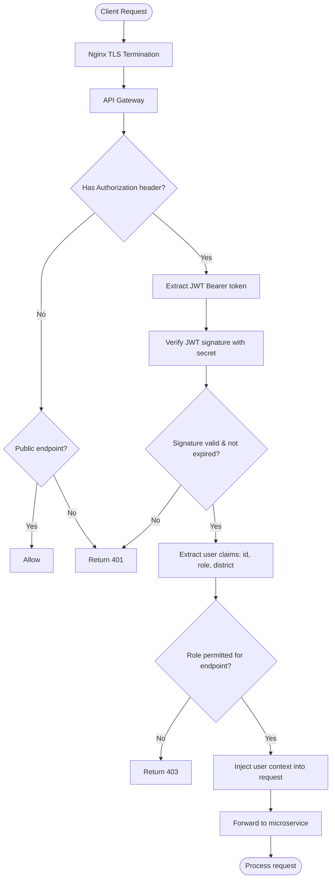

### 12.2 Role Permission Matrix

| Endpoint Category | VISITOR | GATE_OFFICER | DISTRICT_ADMIN | REPORTING_OFFICER | SUPER_ADMIN |
|-------------------|:-------:|:------------:|:--------------:|:-----------------:|:-----------:|
| Register & OTP | ✅ | — | — | — | ✅ |
| Submit registration | ✅ | — | — | — | ✅ |
| View own status | ✅ | — | — | — | ✅ |
| View approval queue | — | — | ✅ | — | ✅ |
| Approve / Reject | — | — | ✅ | — | ✅ |
| Entry scan | — | ✅ | — | — | ✅ |
| Exit scan | — | ✅ | — | — | ✅ |
| Dashboard | — | — | ✅ | ✅ | ✅ |
| Reports / Export | — | — | ✅ | ✅ | ✅ |
| User management | — | — | — | — | ✅ |
| District / Checkpoint config | — | — | — | — | ✅ |
| Audit trail | — | — | — | ✅ | ✅ |

### 12.3 QR Token Security

QR codes are generated as **signed JWT tokens** with the following payload:

```json
{
  "sub": "VISIT-2026-00000042",
  "visitorId": 101,
  "checkpointId": "SECRETARIAT_MAIN",
  "windowStart": 1741168800,
  "windowEnd": 1741204800,
  "iat": 1741082400,
  "exp": 1741204800,
  "jti": "qr-a0042-nonce"
}
```

- Signed with **HMAC-SHA256** using a per-deployment secret (minimum 256 bits)
- `exp` is set to the approved `windowEnd` — QR is automatically invalid after visit window
- `jti` (JWT ID) prevents replay; server checks `jti` against a used-tokens Redis set
- QR image is delivered over HTTPS; link in SMS is a short-lived signed URL

### 12.4 Data Security Controls

| Control | Implementation |
|---------|---------------|
| Transport encryption | TLS 1.2+ enforced at Nginx |
| Password hashing | BCrypt cost factor 12 |
| JWT secret rotation | Configurable via `JWT_SECRET` env var |
| Document access | Pre-signed URLs valid for 15 minutes |
| Rate limiting | Redis-backed sliding window (OTP: 5/10 min, Login: 10/min) |
| Input validation | Bean Validation (JSR-380) + Angular Reactive Forms validators |
| SQL injection prevention | JPA parameterised queries only |
| XSS prevention | Angular built-in sanitisation + CSP headers via Nginx |
| CORS | Explicit allowed-origins list in Spring Security |
| Dependency scanning | OWASP Dependency-Check in CI pipeline |

---

## 13. Audit & Logging Design

### 13.1 Audit Log Schema

Every state-changing action produces an immutable `audit_logs` record:

```sql
CREATE TABLE audit_logs (
    id           BIGSERIAL PRIMARY KEY,
    entity_type  VARCHAR(100) NOT NULL,   -- PUBLIC_REGISTRATION, VISIT_ENTRY, etc.
    entity_id    BIGINT,
    action       VARCHAR(100) NOT NULL,   -- SUBMITTED, APPROVED, ENTRY_RECORDED, etc.
    details      TEXT,                    -- JSON diff or description
    performed_by VARCHAR(100) NOT NULL,   -- username or SYSTEM
    timestamp    TIMESTAMP    NOT NULL,
    ip_address   VARCHAR(50)
);
```

### 13.2 Audited Events

| Module | Events Audited |
|--------|---------------|
| Registration | `REGISTRATION_INITIATED`, `OTP_SENT`, `OTP_VERIFIED`, `DOCUMENT_UPLOADED`, `REGISTRATION_SUBMITTED` |
| Approval | `APPLICATION_OPENED`, `DOCUMENT_VALIDATED`, `APPLICATION_APPROVED`, `APPLICATION_REJECTED`, `QR_ISSUED`, `ESCALATED` |
| Entry | `QR_SCAN_VALID`, `QR_SCAN_INVALID`, `ENTRY_RECORDED`, `MANUAL_OVERRIDE_ENTRY` |
| Exit | `EXIT_RECORDED`, `OVERSTAY_DETECTED`, `OVERSTAY_RESOLVED` |
| Admin | `USER_CREATED`, `USER_DEACTIVATED`, `ROLE_CHANGED`, `DISTRICT_CONFIGURED`, `CHECKPOINT_CONFIGURED` |
| Auth | `LOGIN_SUCCESS`, `LOGIN_FAILURE`, `TOKEN_REFRESHED`, `PASSWORD_CHANGED` |

### 13.3 Application Logging Strategy

```
Log Level Guidelines:
  ERROR  — Exceptions, security violations, data integrity failures
  WARN   — Business rule violations, invalid QR attempts, rate limit hits
  INFO   — Request/response at API Gateway, state transitions
  DEBUG  — Internal service logic, DB queries (disabled in production)

Log Format (JSON structured):
{
  "timestamp": "2026-03-05T10:15:00.123Z",
  "level": "INFO",
  "service": "entry-service",
  "traceId": "abc123def456",
  "userId": "gate_officer_1",
  "event": "ENTRY_RECORDED",
  "referenceNumber": "VISIT-2026-00000042",
  "checkpointId": "SECRETARIAT_MAIN",
  "durationMs": 120
}
```

### 13.4 Log Retention Policy

| Log Type | Storage | Retention |
|----------|---------|-----------|
| Audit logs | PostgreSQL | 5 years (statutory) |
| Application logs | File / ELK Stack | 90 days rolling |
| Security events | PostgreSQL audit_logs | 5 years |
| API access logs | Nginx access log | 30 days |

---

## 14. Deployment Architecture

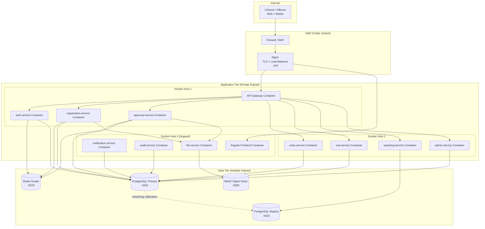

### 14.1 Docker Compose Services

```yaml
# docker-compose.yml (abbreviated)
services:
  nginx:
    image: nginx:1.25-alpine
    ports: ["443:443", "80:80"]
    volumes:
      - ./nginx/nginx.conf:/etc/nginx/nginx.conf
      - ./nginx/certs:/etc/nginx/certs

  frontend:
    build: ./frontend
    environment:
      - API_BASE_URL=https://api.meghaconnect.gov.in

  api-gateway:
    build: ./backend/gateway
    environment:
      - JWT_SECRET=${JWT_SECRET}

  auth-service:
    build: ./backend/auth-service
    environment:
      - DATABASE_URL=jdbc:postgresql://postgres-primary:5432/meghaconnect
      - JWT_SECRET=${JWT_SECRET}
      - REDIS_HOST=redis

  postgres-primary:
    image: postgres:15-alpine
    environment:
      - POSTGRES_DB=meghaconnect
      - POSTGRES_USER=${DB_USER}
      - POSTGRES_PASSWORD=${DB_PASS}
    volumes:
      - pgdata:/var/lib/postgresql/data

  redis:
    image: redis:7-alpine
    command: redis-server --requirepass ${REDIS_PASSWORD}

  minio:
    image: minio/minio:latest
    command: server /data --console-address ":9001"
    environment:
      - MINIO_ROOT_USER=${MINIO_USER}
      - MINIO_ROOT_PASSWORD=${MINIO_PASS}
    volumes:
      - minio_data:/data
```

---

## 15. Folder Structure

### 15.1 Repository Root

```
meghaConnectPrototype/
├── docs/
│   └── SYSTEM_DOCUMENTATION.md        ← This document
├── backend/                            ← Spring Boot backend
│   ├── pom.xml                         ← Parent POM
│   └── src/
│       └── main/
│           ├── java/gov/meghalaya/meghaconnect/
│           │   ├── config/             ← SecurityConfig, SwaggerConfig
│           │   ├── controller/         ← REST controllers per module
│           │   ├── dto/                ← Request/Response DTOs
│           │   ├── entity/             ← JPA entities
│           │   ├── repository/         ← Spring Data JPA repositories
│           │   ├── security/           ← JwtService, JwtAuthFilter, RBAC
│           │   └── service/            ← Business logic services
│           └── resources/
│               ├── application.properties
│               └── db/migration/       ← Flyway SQL migrations
│                   ├── V1__initial_schema.sql
│                   ├── V2__seed_data.sql
│                   ├── V3__extended_schema.sql
│                   ├── V4__public_registration_kyc.sql
│                   └── V5__entry_exit_schema.sql
├── frontend/                           ← Angular 17+ application
│   ├── angular.json
│   ├── tsconfig.json
│   └── src/
│       ├── app/
│       │   ├── auth/                   ← Login, OTP components
│       │   │   └── login/
│       │   ├── dashboard/              ← KPI dashboard
│       │   ├── registration/           ← Visitor registration multi-step form
│       │   │   ├── registration-form/
│       │   │   └── status-tracker/
│       │   ├── approvals/              ← Admin approval queue & detail
│       │   │   ├── approval-queue/
│       │   │   └── approval-detail/
│       │   ├── entry/                  ← Gate entry scanner
│       │   │   └── entry-scanner/
│       │   ├── exit/                   ← Gate exit scanner
│       │   │   └── exit-scanner/
│       │   ├── reports/                ← Dashboard, heatmap, analytics
│       │   │   ├── heatmap/
│       │   │   ├── district-summary/
│       │   │   └── audit-trail/
│       │   ├── admin/                  ← Admin management
│       │   │   ├── user-management/
│       │   │   ├── district-config/
│       │   │   └── checkpoint-config/
│       │   ├── services/               ← Angular injectable services
│       │   ├── guards/                 ← Auth and role guards
│       │   ├── interceptors/           ← JWT interceptor, error handler
│       │   ├── models/                 ← TypeScript interfaces/types
│       │   └── shared/                 ← Reusable components, pipes
│       ├── styles.scss
│       └── main.ts
├── mobile/                             ← Flutter mobile application
│   ├── pubspec.yaml
│   └── lib/
│       ├── main.dart
│       ├── screens/
│       ├── services/
│       └── models/
├── database/
│   ├── schema.sql                      ← Reference schema (canonical)
│   └── README.md
├── nginx/
│   ├── nginx.conf                      ← Nginx reverse proxy config
│   └── certs/                          ← TLS certificates (not in VCS)
├── docker-compose.yml                  ← Full stack orchestration
├── docker-compose.dev.yml              ← Development overrides
├── .env.example                        ← Environment variable template
└── README.md                           ← Project overview
```

### 15.2 Spring Boot Backend Package Structure

```
gov.meghalaya.meghaconnect
├── MeghaConnectApplication.java
├── config/
│   ├── SecurityConfig.java             ← Spring Security + CORS
│   ├── JpaConfig.java
│   └── SwaggerConfig.java
├── controller/
│   ├── AuthController.java
│   ├── RegistrationController.java
│   ├── ApprovalController.java
│   ├── EntryController.java
│   ├── ExitController.java
│   ├── ReportingController.java
│   └── AdminController.java
├── dto/
│   ├── AuthRequest.java / AuthResponse.java
│   ├── PublicRegistrationDto.java
│   ├── ApprovalDto.java
│   ├── EntryRecordDto.java
│   ├── ExitRecordDto.java
│   └── DashboardDto.java
├── entity/
│   ├── BaseEntity.java
│   ├── User.java
│   ├── PublicRegistration.java
│   ├── VisitEntry.java
│   ├── VisitExit.java
│   ├── OverstayAlert.java
│   ├── District.java
│   ├── Checkpoint.java
│   └── AuditLog.java
├── repository/
│   ├── UserRepository.java
│   ├── PublicRegistrationRepository.java
│   ├── VisitEntryRepository.java
│   ├── VisitExitRepository.java
│   └── AuditLogRepository.java
├── security/
│   ├── JwtService.java
│   ├── JwtAuthenticationFilter.java
│   └── UserDetailsServiceImpl.java
└── service/
    ├── AuthService.java
    ├── OtpService.java
    ├── RegistrationService.java
    ├── ApprovalService.java
    ├── EntryService.java
    ├── ExitService.java
    ├── ReportingService.java
    ├── AdminService.java
    ├── NotificationService.java
    └── AuditLogService.java
```

---

*End of Document*

---

**Document Control**

| Version | Date | Author | Change Summary |
|---------|------|--------|---------------|
| 1.0 | 2026-03-03 | Principal Solution Architect | Initial release — covers all 6 modules |
