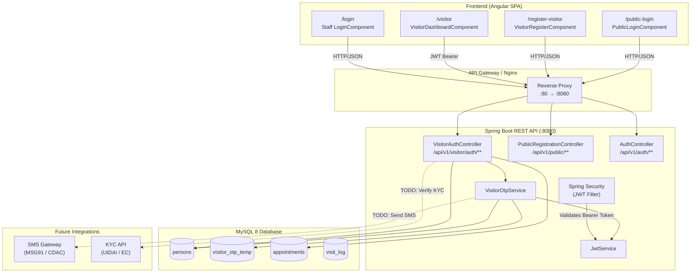
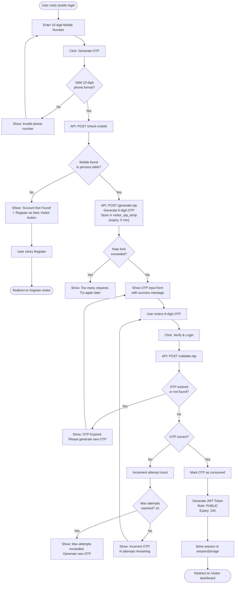
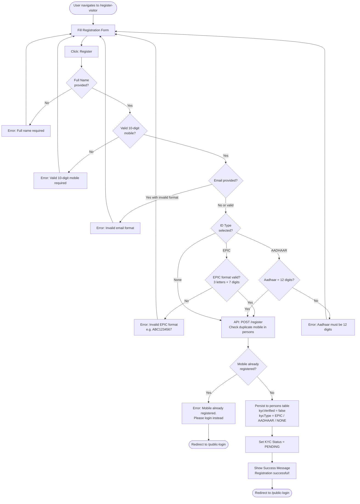
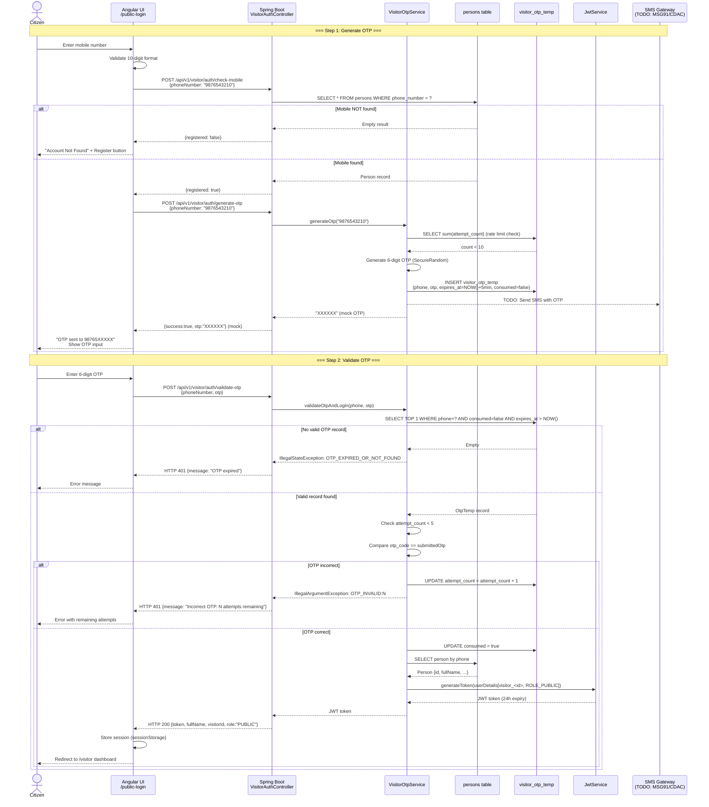

# Visitor Authentication & Registration Flow

**Project:** MeghaConnect – Meghalaya Entry & Governance System  
**Component:** Public / Citizen Authentication  
**Author:** Senior Solution Architect – Survisha Technologies  
**Date:** 2026-03-03  
**Status:** Production-Ready Design

---

## Table of Contents

1. [Screen Flow Explanation](#1-screen-flow-explanation)
2. [High-Level Architecture Diagram](#2-high-level-architecture-diagram)
3. [Login Flowchart](#3-login-flowchart)
4. [Registration Flowchart](#4-registration-flowchart)
5. [Sequence Diagram – OTP Flow](#5-sequence-diagram--otp-flow)
6. [Database Schema Design](#6-database-schema-design)
7. [Table Constraints & Index Strategy](#7-table-constraints--index-strategy)
8. [API Contracts](#8-api-contracts)
9. [Security Considerations](#9-security-considerations)
10. [Error Handling Design](#10-error-handling-design)

---

## 1. Screen Flow Explanation

### 1.1 Public / Citizen Login Page (`/public-login`)

The Citizen Login page is a **dedicated, standalone page** completely separated from the Staff Login page (`/login`). This prevents accidental cross-login and provides a tailored UX for citizens.

**Step 1 – Enter Mobile Number**

| Event | System Action |
|---|---|
| User enters 10-digit mobile number | UI validates format (digits only, length = 10) |
| User clicks **Generate OTP** | `POST /api/v1/visitor/auth/check-mobile` |
| Mobile **NOT found** in `persons` table | Error: "Account Not Found" + "Register as New Visitor" button |
| Mobile **found** in `persons` table | `POST /api/v1/visitor/auth/generate-otp` → OTP stored in `visitor_otp_temp`, simulated delivery |

**Step 2 – Enter OTP**

| Event | System Action |
|---|---|
| User enters 6-digit OTP | UI validates format |
| User clicks **Verify & Login** | `POST /api/v1/visitor/auth/validate-otp` |
| OTP **invalid / expired** | Error message with remaining attempts |
| OTP **valid** | JWT issued, visitor session stored, redirect to `/visitor` dashboard |

### 1.2 Visitor Registration Page (`/register-visitor`)

A **separate, standalone registration page** – never mixed with the login page.

Fields collected:
- Full Name *(required)*
- Mobile Number *(required, unique)*
- Email *(optional)*
- Address *(optional)*
- ID Type: EPIC / Aadhaar *(required)*
- ID Number *(required when type selected)*

After successful registration:
- KYC status set to **PENDING**
- Redirect back to `/public-login`

### 1.3 Visitor Dashboard (`/visitor`)

After successful OTP login, citizens land on the Visitor Dashboard which shows:

1. **Visitor Profile Card** – Name, mobile, KYC status, address, district
2. **KPI Cards** – Total appointments, total visits, active schemes, grievances
3. **Quick Actions** – Book Appointment, Apply for Scheme, Raise Grievance
4. **Appointment History** – All appointments with status
5. **Active Schemes** – Scheme applications
6. **Visit Count Analytics** – Aggregated statistics

---

## 2. High-Level Architecture Diagram



---

## 3. Login Flowchart



---

## 4. Registration Flowchart



---

## 5. Sequence Diagram – OTP Flow



---

## 6. Database Schema Design

### 6.1 VISITOR Table (`persons`)

```sql
CREATE TABLE persons (
    id                  BIGINT        NOT NULL AUTO_INCREMENT,
    full_name           VARCHAR(200)  NOT NULL,
    phone_number        VARCHAR(20),
    email               VARCHAR(150),
    epic_number         VARCHAR(50),
    aadhaar_number      VARCHAR(20),
    kyc_type            VARCHAR(10)   COMMENT 'EPIC | AADHAAR | NONE',
    kyc_verified        TINYINT(1)    DEFAULT 0,
    kyc_verified_at     DATETIME,
    photo_storage_path  VARCHAR(500),
    photo_path          VARCHAR(200),  -- legacy, prefer photo_storage_path
    designation         VARCHAR(100),
    district            VARCHAR(100),
    constituency        VARCHAR(100),
    booth               VARCHAR(100),
    village             VARCHAR(100),
    brief_profile       TEXT,
    date_of_birth       DATE,
    address             VARCHAR(500),
    face_embedding_ref  VARCHAR(500),
    created_at          DATETIME      NOT NULL DEFAULT CURRENT_TIMESTAMP,
    updated_at          DATETIME      NOT NULL DEFAULT CURRENT_TIMESTAMP ON UPDATE CURRENT_TIMESTAMP,
    created_by          VARCHAR(100),
    updated_by          VARCHAR(100),
    PRIMARY KEY (id)
) ENGINE=InnoDB DEFAULT CHARSET=utf8mb4;
```

### 6.2 OTP_TEMP Table (`visitor_otp_temp`)

```sql
CREATE TABLE visitor_otp_temp (
    id            BIGINT        NOT NULL AUTO_INCREMENT PRIMARY KEY,
    phone_number  VARCHAR(20)   NOT NULL,
    otp_code      VARCHAR(10)   NOT NULL,
    expires_at    DATETIME      NOT NULL,
    consumed      TINYINT(1)    NOT NULL DEFAULT 0,
    attempt_count INT           NOT NULL DEFAULT 0,
    created_at    DATETIME      NOT NULL DEFAULT CURRENT_TIMESTAMP
) ENGINE=InnoDB DEFAULT CHARSET=utf8mb4;
```

> **Design Note:** OTP codes are stored as plain text for simplicity in the prototype. In production, store a **BCrypt hash** of the OTP and compare using constant-time comparison.

### 6.3 APPOINTMENT Table (`appointments`)

```sql
CREATE TABLE appointments (
    id                           BIGINT        NOT NULL AUTO_INCREMENT,
    application_id               VARCHAR(30)   NOT NULL UNIQUE,
    applicant_id                 BIGINT        NOT NULL,  -- FK → persons.id
    agenda_type                  VARCHAR(50),
    agenda_brief                 TEXT,
    status                       VARCHAR(30)   NOT NULL DEFAULT 'SUBMITTED',
    requested_location           VARCHAR(30),
    scheduled_date_time          DATETIME,
    scheduled_duration_minutes   INT,
    event_type                   VARCHAR(10),
    mla_mdc_approved             TINYINT(1)    DEFAULT 0,
    meeting_count_last_6_months  INT           DEFAULT 0,
    cmo_remarks                  TEXT,
    approver_remarks             TEXT,
    hcm_remarks                  TEXT,
    short_notes                  TEXT,
    is_walk_in                   TINYINT(1)    DEFAULT 0,
    created_at                   DATETIME      NOT NULL DEFAULT CURRENT_TIMESTAMP,
    updated_at                   DATETIME      NOT NULL DEFAULT CURRENT_TIMESTAMP ON UPDATE CURRENT_TIMESTAMP,
    created_by                   VARCHAR(100),
    updated_by                   VARCHAR(100),
    PRIMARY KEY (id),
    CONSTRAINT fk_appt_applicant FOREIGN KEY (applicant_id) REFERENCES persons(id)
) ENGINE=InnoDB DEFAULT CHARSET=utf8mb4;
```

### 6.4 VISIT_LOG Table (`visit_log`)

```sql
CREATE TABLE visit_log (
    id              BIGINT        NOT NULL AUTO_INCREMENT PRIMARY KEY,
    person_id       BIGINT        NOT NULL,  -- FK → persons.id
    appointment_id  BIGINT,                  -- FK → appointments.id (nullable for walk-ins)
    visit_type      VARCHAR(30)   NOT NULL DEFAULT 'APPOINTMENT',
    entry_time      DATETIME      NOT NULL,
    exit_time       DATETIME,
    entry_point     VARCHAR(100),
    recorded_by     VARCHAR(100),
    notes           TEXT,
    created_at      DATETIME      NOT NULL DEFAULT CURRENT_TIMESTAMP,
    CONSTRAINT fk_visit_person FOREIGN KEY (person_id)      REFERENCES persons(id),
    CONSTRAINT fk_visit_appt   FOREIGN KEY (appointment_id) REFERENCES appointments(id)
) ENGINE=InnoDB DEFAULT CHARSET=utf8mb4;
```

---

## 7. Table Constraints & Index Strategy

### `persons` table

| Index Name | Column(s) | Type | Purpose |
|---|---|---|---|
| `PRIMARY` | `id` | PK | Row lookup |
| `idx_person_phone` | `phone_number` | BTree | OTP login lookup, uniqueness check |
| `idx_person_epic` | `epic_number` | BTree | KYC verification, duplicate check |
| `idx_person_aadhaar` | `aadhaar_number` | BTree | KYC verification |
| `idx_person_name` | `full_name` | BTree | Search by name |

**Uniqueness:**  
`phone_number` should have a `UNIQUE` constraint in production once legacy data migration is complete. Currently guarded at application layer via duplicate-check before INSERT.

### `visitor_otp_temp` table

| Index Name | Column(s) | Type | Purpose |
|---|---|---|---|
| `PRIMARY` | `id` | PK | Row lookup |
| `idx_otp_phone` | `phone_number` | BTree | Fast lookup during validate |
| `idx_otp_expiry` | `expires_at` | BTree | Efficient purge of expired records |

**Scheduled Cleanup:**  
Run `DELETE FROM visitor_otp_temp WHERE expires_at < NOW()` periodically (e.g., every 30 minutes via Spring `@Scheduled`).

### `appointments` table

| Index Name | Column(s) | Type | Purpose |
|---|---|---|---|
| `PRIMARY` | `id` | PK | Row lookup |
| `idx_appt_app_id` | `application_id` | UNIQUE | Human-readable ID lookup |
| `idx_appt_applicant` | `applicant_id` | BTree | Visitor's appointment history |
| `idx_appt_status` | `status` | BTree | Status-based filtering |
| `idx_appt_scheduled` | `scheduled_date_time` | BTree | Calendar/scheduling queries |

### `visit_log` table

| Index Name | Column(s) | Type | Purpose |
|---|---|---|---|
| `PRIMARY` | `id` | PK | Row lookup |
| `idx_visit_person` | `person_id` | BTree | Visit history per person |
| `idx_visit_entry` | `entry_time` | BTree | Date-range analytics |

---

## 8. API Contracts

All endpoints under `/api/v1/visitor/auth/**` are **publicly accessible** (no JWT required).  
After login, use the returned JWT as `Authorization: Bearer <token>` for protected endpoints.

---

### 8.1 Check Mobile

`POST /api/v1/visitor/auth/check-mobile`

**Request:**
```json
{
  "phoneNumber": "9876543210"
}
```

**Response 200 OK – Found:**
```json
{
  "success": true,
  "registered": true,
  "message": "Account found"
}
```

**Response 200 OK – Not Found:**
```json
{
  "success": true,
  "registered": false,
  "message": "Account not found"
}
```

**Response 400 Bad Request:**
```json
{
  "success": false,
  "message": "phoneNumber is required"
}
```

---

### 8.2 Generate OTP

`POST /api/v1/visitor/auth/generate-otp`

**Request:**
```json
{
  "phoneNumber": "9876543210"
}
```

**Response 200 OK:**
```json
{
  "success": true,
  "otp": "482931",
  "message": "OTP sent to 9876543210 (mock)"
}
```

> ⚠️ **Note:** The `otp` field is only present in the mock/simulation mode. Once an SMS gateway is integrated, this field **must be removed** from the response.

**Response 404 – Mobile Not Registered:**
```json
{
  "success": false,
  "errorCode": "MOBILE_NOT_FOUND",
  "message": "Mobile number not registered. Please register first."
}
```

**Response 429 – Rate Limited:**
```json
{
  "success": false,
  "errorCode": "OTP_RATE_LIMIT_EXCEEDED",
  "message": "Too many OTP requests. Please try again later."
}
```

---

### 8.3 Validate OTP

`POST /api/v1/visitor/auth/validate-otp`

**Request:**
```json
{
  "phoneNumber": "9876543210",
  "otp": "482931"
}
```

**Response 200 OK – Success:**
```json
{
  "success": true,
  "token": "eyJhbGciOiJIUzI1NiJ9...",
  "fullName": "Ramesh Kumar",
  "visitorId": 42,
  "role": "PUBLIC",
  "message": "Login successful"
}
```

**Response 401 – Invalid OTP:**
```json
{
  "success": false,
  "errorCode": "OTP_INVALID:4",
  "message": "Incorrect OTP. 4 attempts remaining."
}
```

**Response 401 – OTP Expired:**
```json
{
  "success": false,
  "errorCode": "OTP_EXPIRED_OR_NOT_FOUND",
  "message": "OTP has expired or was not found. Please generate a new OTP."
}
```

**Response 401 – Max Attempts:**
```json
{
  "success": false,
  "errorCode": "OTP_MAX_ATTEMPTS_EXCEEDED",
  "message": "Maximum OTP attempts exceeded. Please generate a new OTP."
}
```

---

### 8.4 Register Visitor

`POST /api/v1/visitor/auth/register`

**Request:**
```json
{
  "fullName": "Ramesh Kumar",
  "phoneNumber": "9876543210",
  "email": "ramesh@example.com",
  "address": "Village Mawlynnong, East Khasi Hills",
  "epicNumber": "ABC1234567",
  "aadhaarNumber": null,
  "photoStoragePath": null
}
```

**Response 200 OK – Success:**
```json
{
  "success": true,
  "visitorId": 42,
  "kycStatus": "PENDING",
  "kycType": "EPIC",
  "message": "Registration successful. Please login with your mobile number."
}
```

**Response 400 – Validation Error:**
```json
{
  "success": false,
  "errorCode": "INVALID_EPIC_FORMAT",
  "message": "EPIC number must be 3 uppercase letters followed by 7 digits (e.g. ABC1234567)"
}
```

**Response 409 – Duplicate Mobile:**
```json
{
  "success": false,
  "errorCode": "MOBILE_ALREADY_REGISTERED",
  "message": "This mobile number is already registered. Please login instead."
}
```

---

### 8.5 Get Visitor Profile

`GET /api/v1/visitor/auth/profile/{visitorId}`

**Headers:** `Authorization: Bearer <jwt>`

**Response 200 OK:**
```json
{
  "success": true,
  "id": 42,
  "fullName": "Ramesh Kumar",
  "phoneNumber": "9876543210",
  "epicNumber": "ABC1234567",
  "aadhaarNumber": "",
  "kycType": "EPIC",
  "kycVerified": false,
  "address": "Village Mawlynnong, East Khasi Hills",
  "district": "East Khasi Hills"
}
```

**Response 404 – Not Found:**
```json
{
  "success": false,
  "message": "Visitor not found"
}
```

---

## 9. Security Considerations

### 9.1 OTP Expiry Handling

| Parameter | Value | Notes |
|---|---|---|
| OTP validity | **5 minutes** | Configurable via `OTP_VALIDITY_MINUTES` constant |
| OTP length | **6 digits** | Generated with `SecureRandom` – cryptographically random |
| OTP storage | Plain text (prototype) | **Production:** Store BCrypt hash; use constant-time compare |
| Consumed flag | `consumed = true` after use | Prevents OTP replay attacks |
| Expired records | Purged by scheduler | Keep DB clean; `DELETE WHERE expires_at < NOW()` |

### 9.2 Brute Force Prevention

| Control | Implementation | Limit |
|---|---|---|
| Per-OTP attempt limit | `attempt_count` field on `visitor_otp_temp` | **5 attempts** per OTP |
| OTP request rate limit | Sum of `attempt_count` within 60-min window | **10 requests** per phone per hour |
| Account lockout | Future: lock `persons` record after N failed logins | TBD |

**Recommended Production Additions:**
- IP-based rate limiting at Nginx/API Gateway layer
- CAPTCHA on the OTP request form after 3 failed attempts
- Suspicious activity alerting (e.g., > 5 OTP requests from same IP)

### 9.3 JWT Security

| Parameter | Value |
|---|---|
| Algorithm | **HS256** (HMAC-SHA256) |
| Expiration | **24 hours** (`86400000 ms`) |
| Secret key | Minimum 256-bit, Base64-encoded, from env var `JWT_SECRET` |
| Claims | `sub` = `visitor_<id>`, `roles` = `[ROLE_PUBLIC]` |
| Storage | `sessionStorage` (cleared on tab/browser close) |

**Production Recommendations:**
- Use **RS256** (asymmetric) for cross-service verification
- Implement refresh token flow for mobile apps
- Set `httpOnly` cookie instead of `sessionStorage` for web apps
- Rotate JWT secret regularly

### 9.4 Input Validation

| Field | Validation Rule |
|---|---|
| `phoneNumber` | Exactly 10 digits (`^\d{10}$`) |
| `epicNumber` | Pattern `^[A-Z]{3}[0-9]{7}$` |
| `aadhaarNumber` | Exactly 12 digits (`^[0-9]{12}$`) |
| `email` | RFC 5322 format (optional) |
| `otp` | 6-character string, matched against DB record |

### 9.5 API Security

- All `/api/v1/visitor/auth/**` endpoints are **public** (no JWT required)
- Protected endpoints (profile, appointments) require valid JWT
- CORS is configured for the frontend origin (currently `*` – tighten in production)
- CSRF is disabled (JWT Bearer auth, stateless API)

---

## 10. Error Handling Design

### 10.1 Error Response Structure

All error responses follow a consistent JSON structure:

```json
{
  "success": false,
  "errorCode": "MACHINE_READABLE_CODE",
  "message": "Human-readable description for the user"
}
```

### 10.2 Error Code Reference

| Error Code | HTTP Status | Description | User Action |
|---|---|---|---|
| `MOBILE_NOT_FOUND` | 404 | Phone not in persons table | Redirect to Register |
| `MOBILE_ALREADY_REGISTERED` | 409 | Phone already registered | Redirect to Login |
| `OTP_EXPIRED_OR_NOT_FOUND` | 401 | No valid OTP record exists | Generate new OTP |
| `OTP_INVALID:N` | 401 | Wrong OTP, N attempts left | Re-enter OTP |
| `OTP_MAX_ATTEMPTS_EXCEEDED` | 401 | 5 wrong attempts consumed | Generate new OTP |
| `OTP_RATE_LIMIT_EXCEEDED` | 429 | Too many OTP requests | Wait and retry |
| `INVALID_EPIC_FORMAT` | 400 | EPIC doesn't match pattern | Fix input |
| `INVALID_AADHAAR_FORMAT` | 400 | Aadhaar not 12 digits | Fix input |
| `VALIDATION_ERROR` | 400 | Required field missing | Fix input |

### 10.3 Frontend Error Handling Strategy

```
API Error Response
       │
       ├─ 400 Bad Request  → Show field-level validation message
       ├─ 401 Unauthorized → Show inline OTP/auth error
       ├─ 404 Not Found    → Show "Account Not Found" + Register button
       ├─ 409 Conflict     → Show "Already registered" + Login button
       ├─ 429 Too Many     → Show "Too many requests, try after X minutes"
       └─ 5xx Server Error → Show "Something went wrong. Please try again."
```

### 10.4 Backend Exception Handling

The `VisitorAuthController` uses try-catch blocks that map to specific HTTP status codes:

- `IllegalArgumentException` → HTTP 400 / 401 (validation and auth errors)
- `IllegalStateException` → HTTP 401 / 429 (OTP state errors)
- Unhandled exceptions → HTTP 500 (handled by Spring's default error handler)

**Recommended Production Addition:** Implement a `@ControllerAdvice` global exception handler for consistent error response formatting across all controllers.

---

*Document generated as part of MeghaConnect Visitor Authentication implementation.*  
*Next steps: SMS gateway integration (MSG91 / CDAC), UIDAI Aadhaar e-KYC, EC API EPIC verification.*
